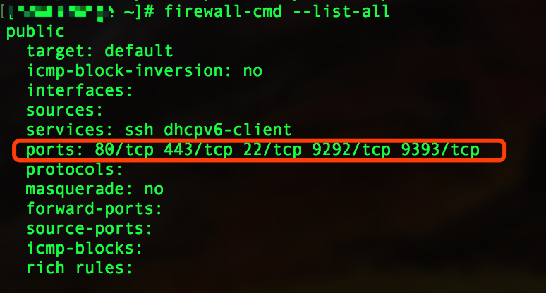
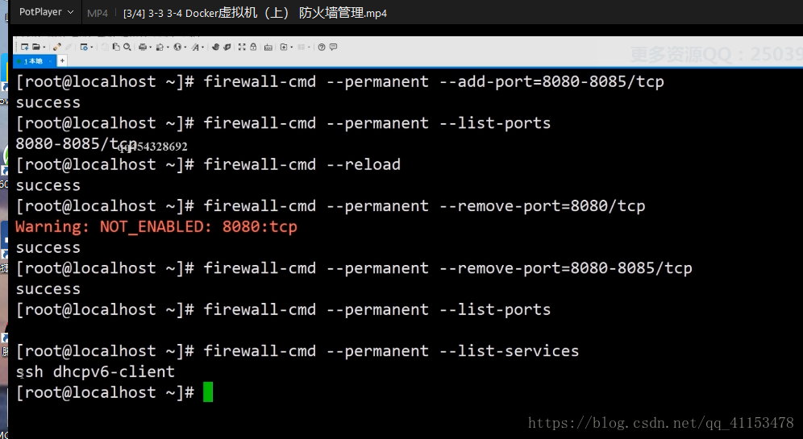

# Centos7防火墙配置
### 1、查看firewall服务状态

systemctl status firewalld

### 2、查看firewall的状态

firewall-cmd --state

### 3、开启、重启、关闭、firewalld.service服务

#查看linux哪些程序正在使用互联网

firewall-cmd --permanent --list-services ssh dhcpv6-client

开启

systemctl start firewalld 

重启

systemctl restart firewalld 

关闭

systemctl stop firewalld 

移除开机自启

systemctl disable firewalld 

### 4、查看防火墙规则

firewall-cmd --list-all 

### 5、查询、开放、关闭端口

查询端口是否开放

firewall-cmd --query-port=8080/tcp

开放80端口

firewall-cmd --permanent --add-port=80/tcp
firewall-cmd --permanent --add-port=8080-8085/tcp

移除端口

firewall-cmd --permanent --remove-port=8080/tcp
查看防火墙的开放的端口
firewall-cmd --permanent --list-ports

#重启防火墙(修改配置后要重启防火墙)
firewall-cmd --reload

参数解释

1、firwall-cmd：是Linux提供的操作firewall的一个工具；
2、--permanent：表示设置为持久；
3、--add-port：标识添加的端口；

