一、查看进程

了解系统中的进程状态是对进程进行管理的前提，使用不同的命令可以从不同的角度查看进程状态。

1、ps命令

ps命令是Linux系统中最为常见用的进程查看工具，主要用于显示包含当前运行的各进程完整信息的静态快照。通过不同的选项，可以有选择的查看进程信息。

a ： 显示当前终端下的所有进程信息，包括其他用户的进程

u ：以用户为主的进程状态

x ：通常与 a 这个参数一起使用，显示当前用户在所有终端下的进程信息

-e：显示系统内所有的进程信息

-l ：使用长格式显示进程信息

-f ：使用完整的格式显示进程信息

执行“**ps aux**”命令。将以简单的列表形式显示出进程信息。

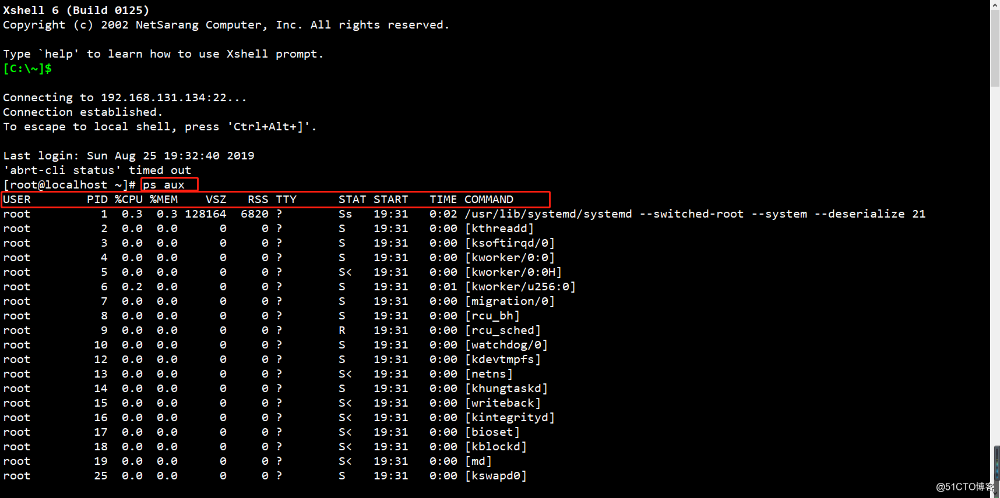

第一行列表标题各字段的含义

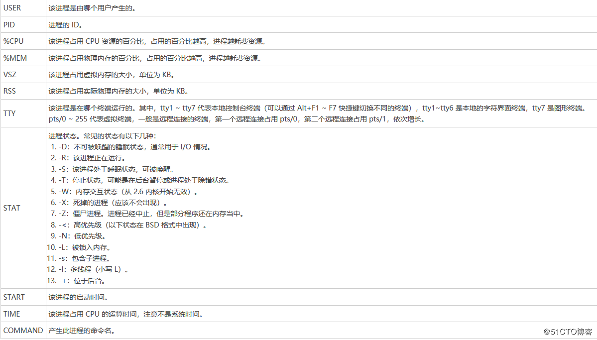

执行“ps -elf”命令，将以长格式显示系统的进程信息，并包含更丰富的内容。

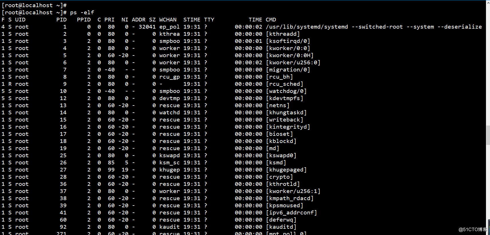

第一行列表标题各字段的含义

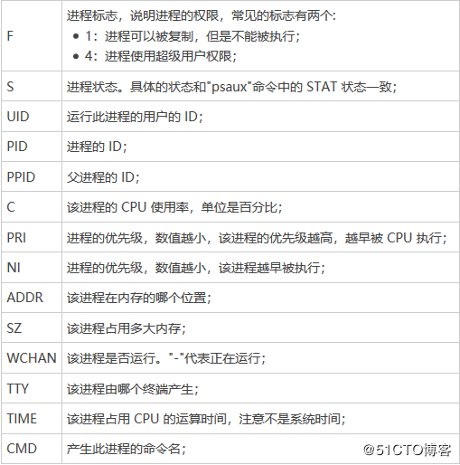

2、top命令

top命令将会在当前终端以全屏交互式的界面显示进程排名，及时跟踪CPU、内存等系统资源占用情况，默认情况下每三秒刷新一次，其作用类似于windows系统

中的任务管理器。

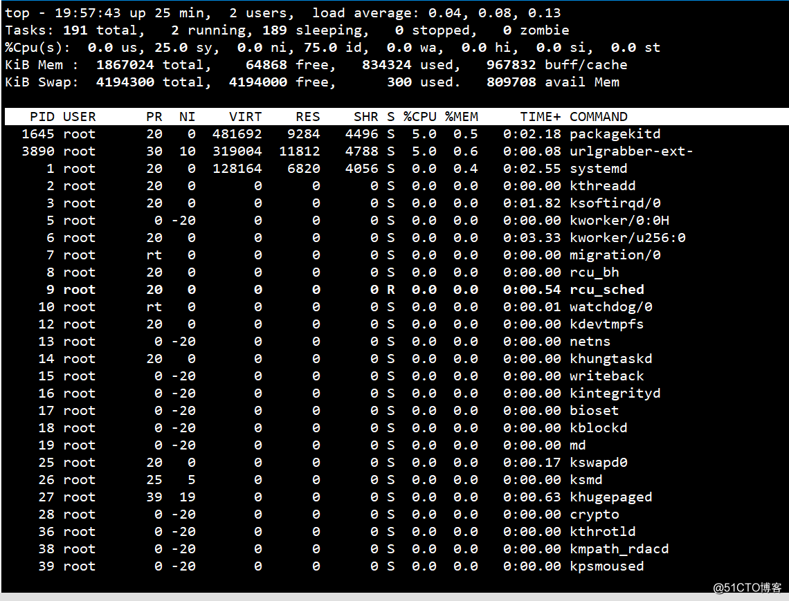

top命令各行参数的含义

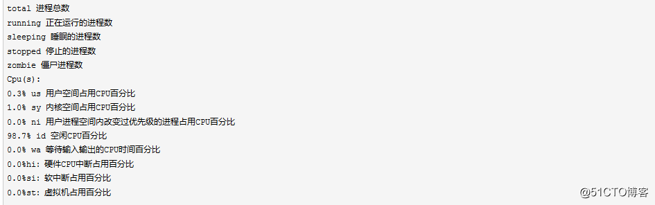

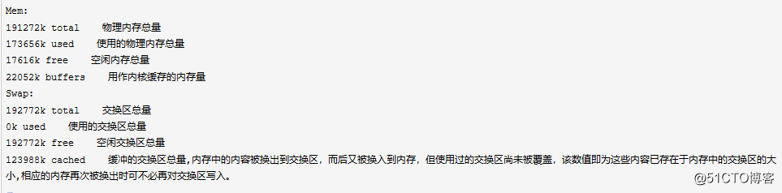

3、pgrep命令

使用pgrep命令可以根据进程的名称、运行该进程的用户、进程所在的终端等多中属性查询特定进程的PID号。

例如查看用户fan正在运行的所有进程。

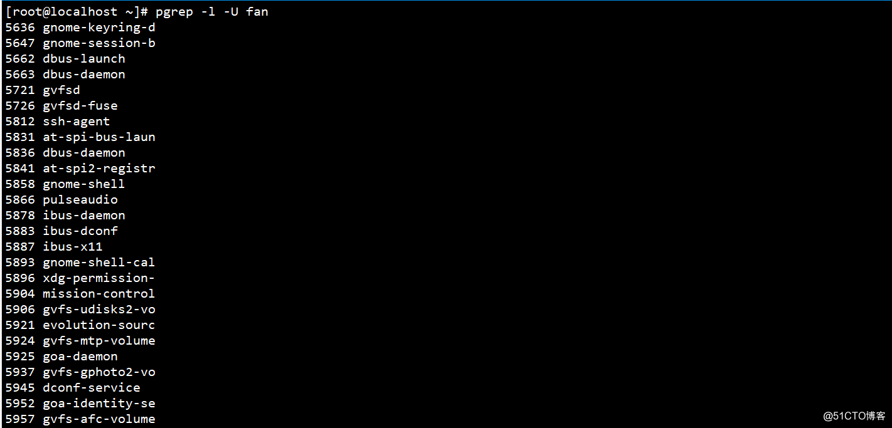

pstree命令

pstree命令可以输出Linux系统中各个进程的树形结构，更加直观地判断出各进程之间的关系。

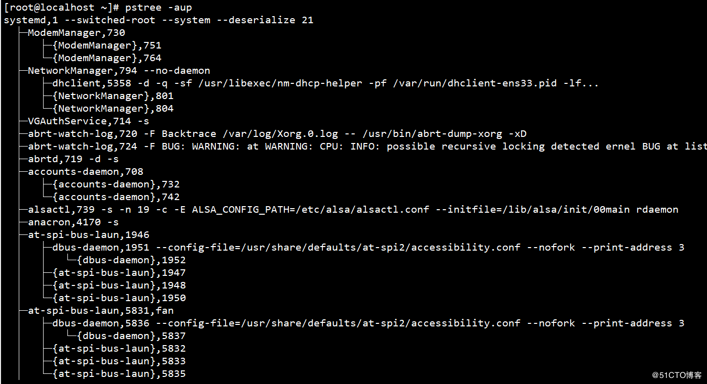

二、控制进程

1、启动进程

在Linux系统中，可以由用户手动启动或按照预定计划调度启动新的进程。

1）、手动启动进程

进程一般分为前台进程与后台进程，进程在前台运行时，用户必须要等到该进程结束才能进行别的操作，但是当我们执行一个时间比较久的命令时，不能做别的操

作难免有些浪费时间这时就轮到我们的后台进程发挥作用了，进程在后台运行时无需等待其完成就可以进行其他命令的操作。启动后台运行需要在执行命令的最后

加上&符号。

比如我们对镜像文件中的Packages进行复制，并将其放入后台运行。

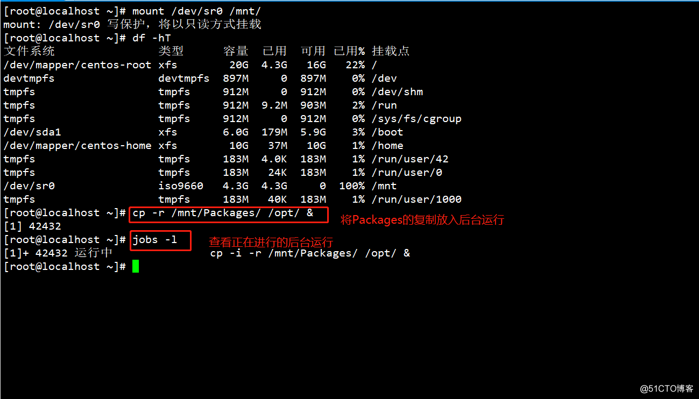

2）、改变进程的运行方式

Ctrl+z：挂起当前进程

jobs -l：查看后台进程

fg：恢复进程

kill -9：结束进程

使用killall命令终止进程

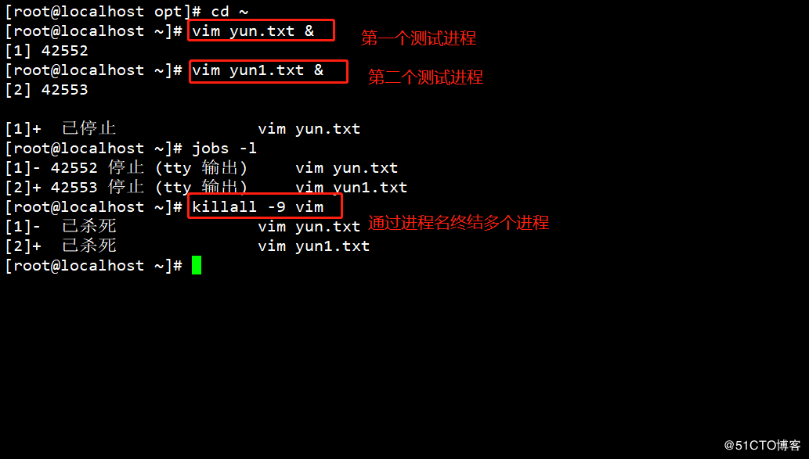

使用pkill命令终止进程

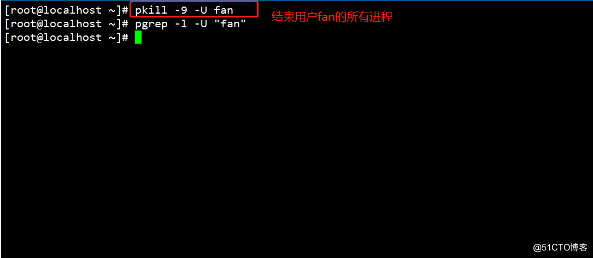

.png)