# EMQX数据桥接

一个MQTT客户端转发到EMQX然后，EMQX转发到另外一个MQTT服务器。

## 1.部署EMQX

[Docker部署方式](https://www.emqx.io/docs/zh/v5.0/deploy/install-docker.html#%E9%80%9A%E8%BF%87-docker-%E8%BF%90%E8%A1%8C%E5%8D%95%E4%B8%AA-emqx-%E8%8A%82%E7%82%B9)

```
#下载镜像
docker pull emqx/emqx:5.0.26

#运行
docker run --restart=always -d --name emqx -p 1883:1883 -p 8083:8083 -p 8084:8084 -p 8883:8883 -p 18083:18083 emqx/emqx:5.0.26
```

## 2.登录

登录默认的端口号为18083，账号为admin，密码为public，第一次登录后需要重新设置密码

## 3.准备另外一个MQTT服务器

这里选用mosquito，具体可以百度

## 4.在EMQX配置MQTT账号信息

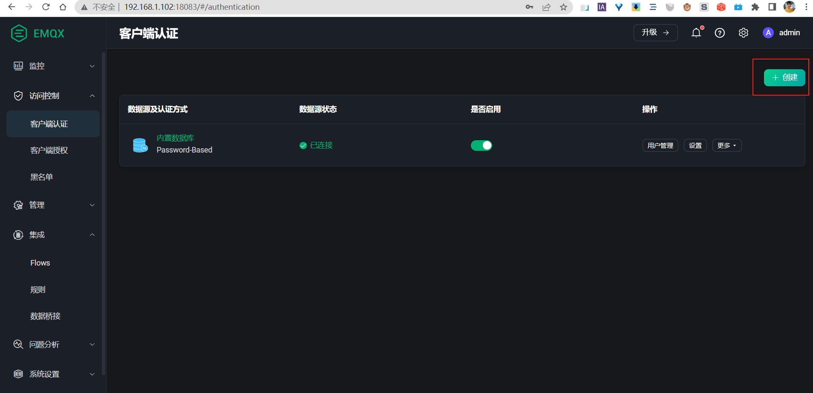

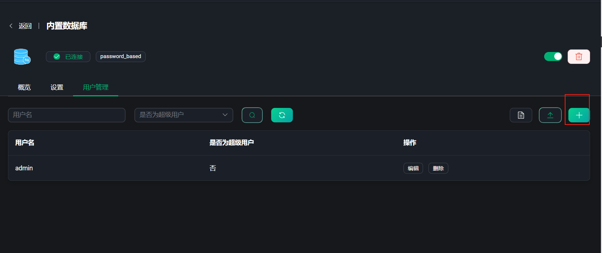

这里都是admin/admin

## 5.用MQTTX测试连接

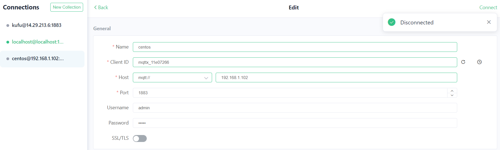

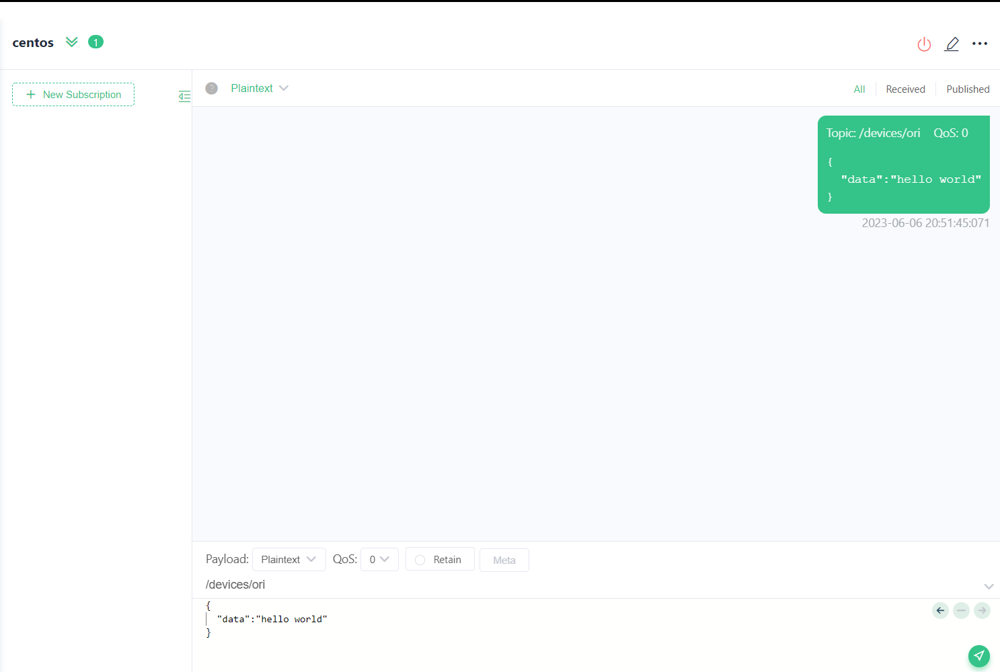

## 6.测试Mosquitto连接

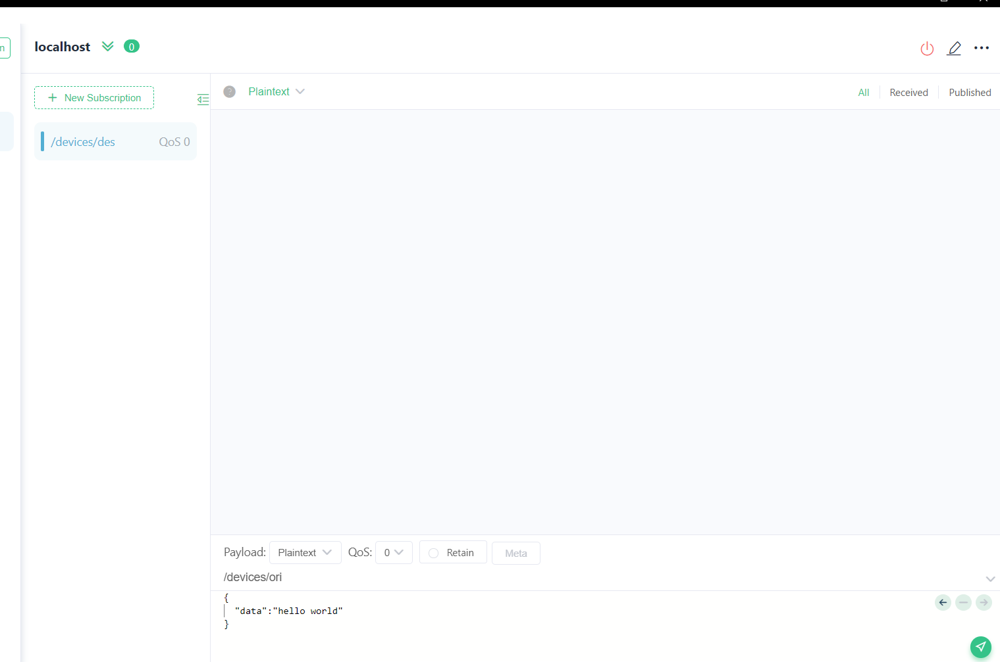

## 7.配置数据桥接

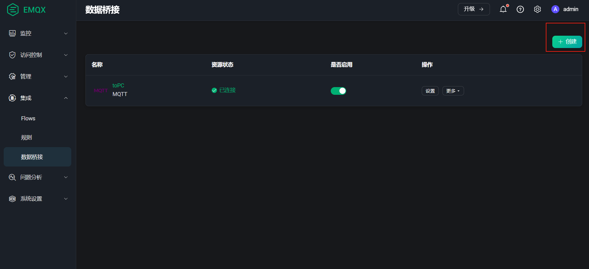

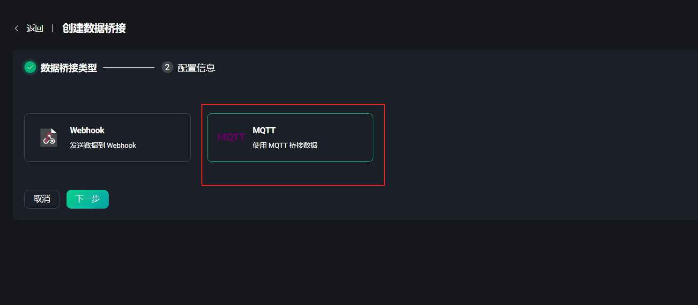

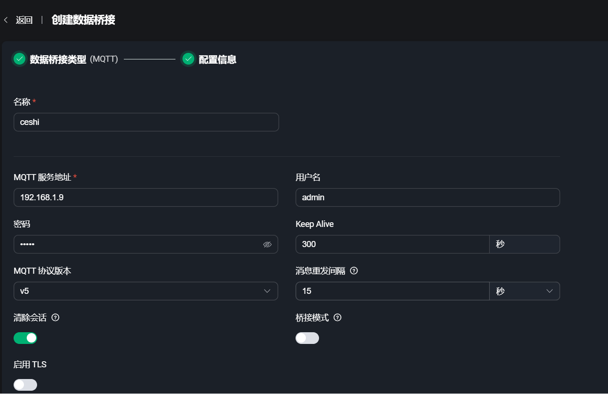

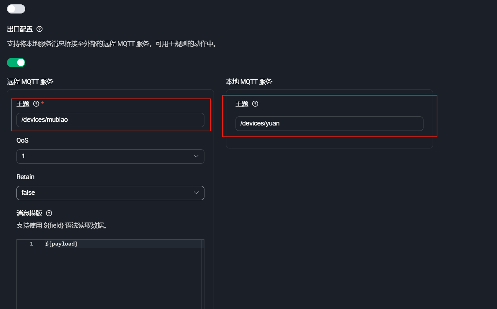

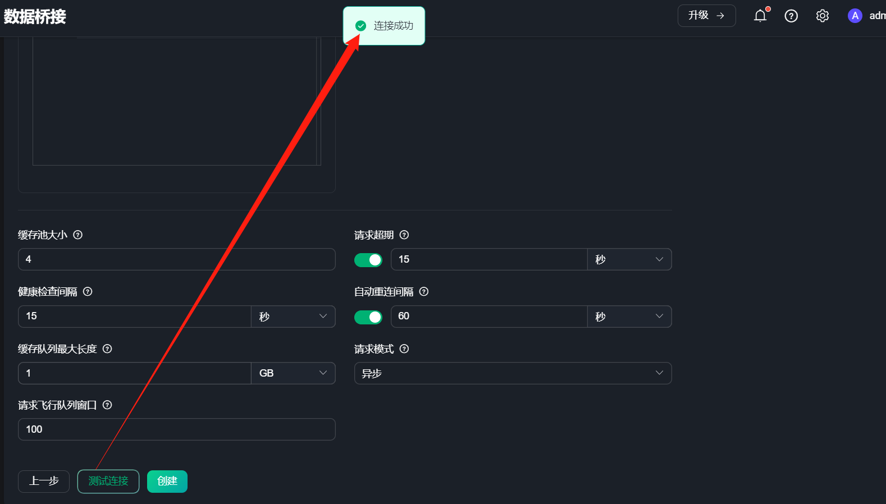

连续点两次创建

## 8.测试


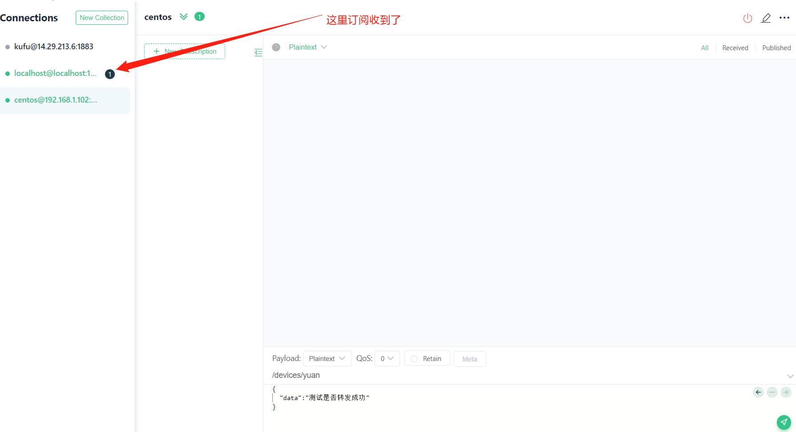

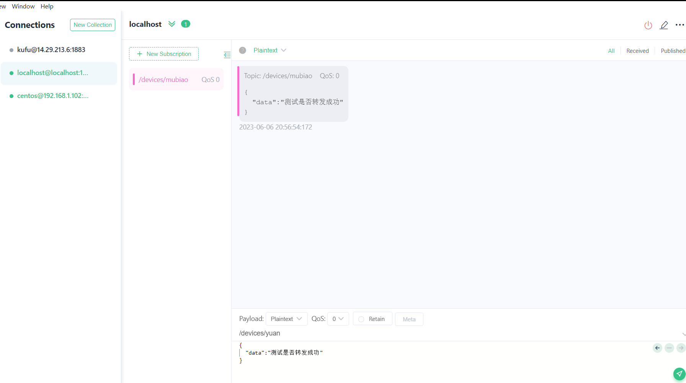


## 9.测试转发到IOT平台

创建设备，凭据为test

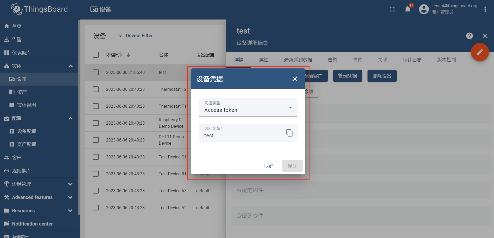

Mqtt端口号为1884

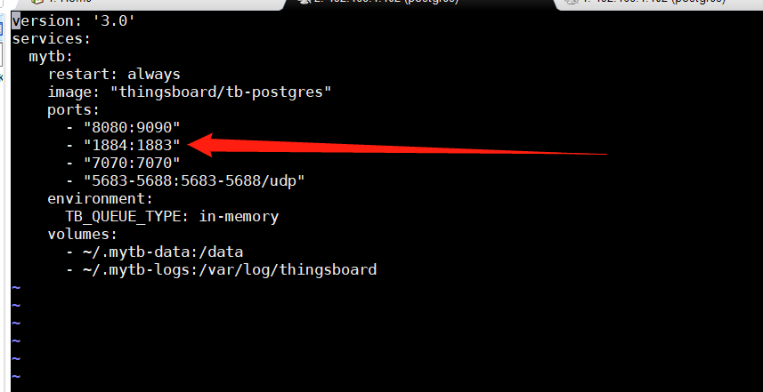

配置转发

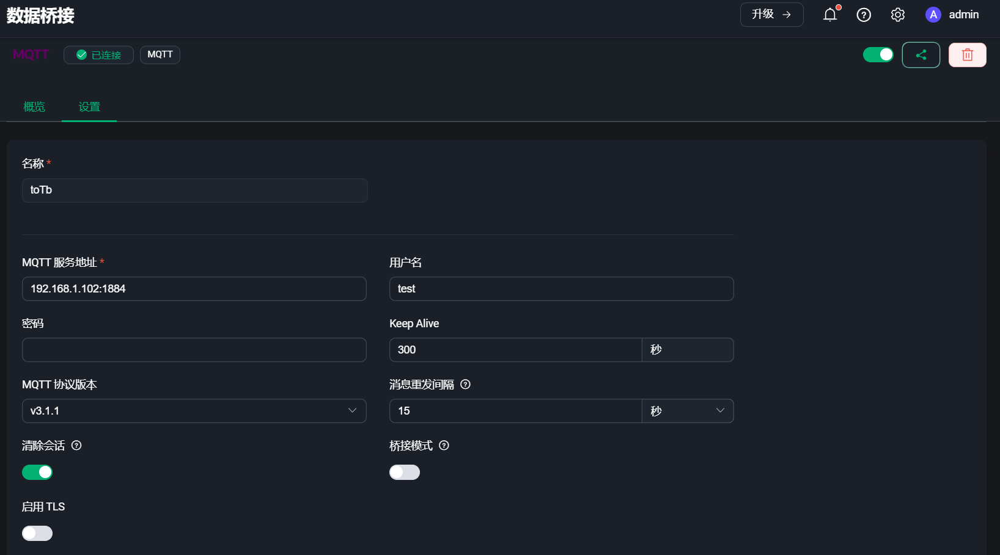

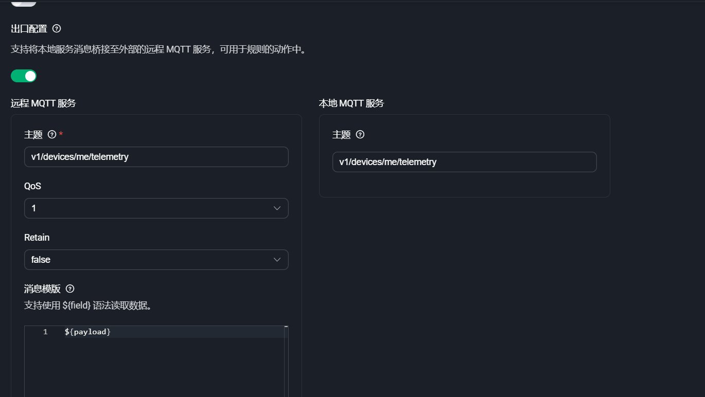

转发

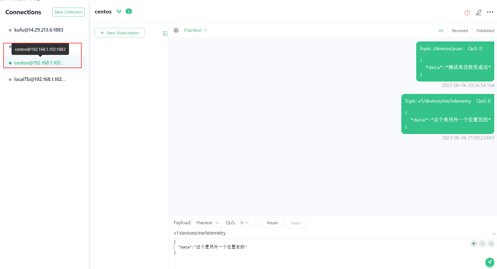

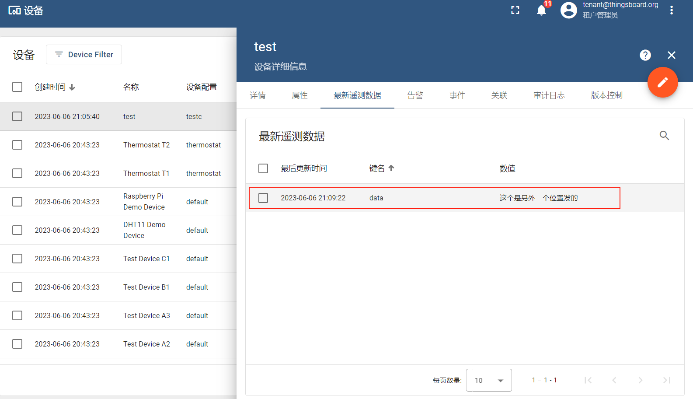