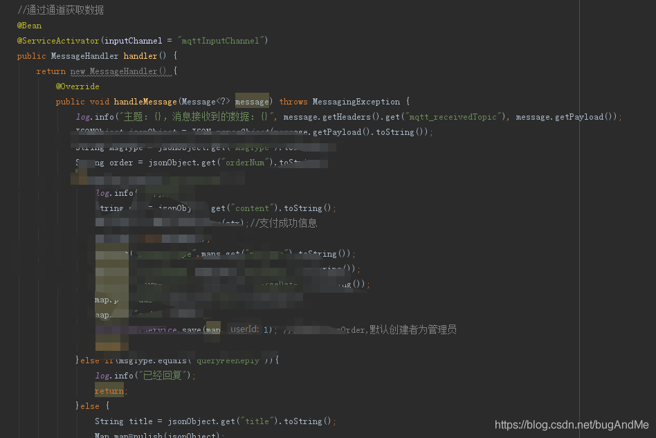
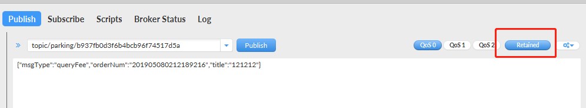
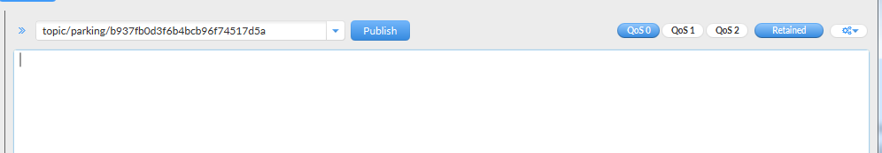
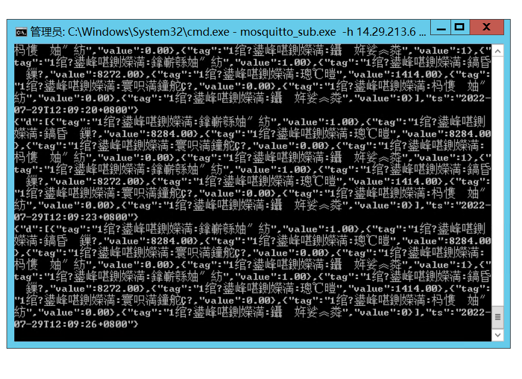

# 重新订阅mosquitto后，会有大量历史数据推送到客户端的问题处理

[MQTT订阅主题就会收到消息的问题--Retained](https://blog.csdn.net/bugAndMe/article/details/90692008)

## 问题产生的缘由                                            

**MQTT订阅主题就会收到消息的问题–Retained**

之前的项目使用了mqtt[消息队列](https://so.csdn.net/so/search?q=消息队列&spm=1001.2101.3001.7020)作为第三方消息的接收和发送，本地作为mqtt的订阅者也作为发送者。
 本地接受到mqtt订阅的消息，作处理后再重新发送到[云服务](https://so.csdn.net/so/search?q=云服务&spm=1001.2101.3001.7020)端。这里遇到一个坑（其实是自己造成的），在订阅主题后就会收到mqtt服务器发送的消息，查找资料后发现是在publish某条数据时，设置了Retained（默认是ture，这里选择后为false）。
 
 详细资料可以查看https://blog.csdn.net/libaineu2004/article/details/78667726
 大意是设置了Retained，那每次有客户端订阅该主题，就会发送你之前设置了Retained的publish的数据。
 解决的办法就是再publish一条无数据的带Retained（false）的消息即可。
 
 之后再publish就不要带Retained
 或者在代码里设置MqttMessage的Retained为false。

## 解决方法

1、修改mosquitto.conf文件，设置retain_available为false

```
# Set to false to disable retained message support. If a client publishes a
# message with the retain bit set, it will be disconnected if this is set to
# false.
retain_available false
```

2、按照官方指引： 删除历史数据：

[官方文档参考](https://mosquitto.org/man/mosquitto_sub-1.html)

```
--remove-retained
If this argument is given, the when mosquitto_sub receives a message with the retained bit set, it will send a message to the broker to clear that retained message. This applies to all received messages except those that are filtered out by the -T option. This option still takes effect even if -R is used. See also the --retain-as-published and --retained-only options.

Example 1. 
Remove all retained messages on the server, assuming we have access to do so, and then exit:

mosquitto_sub -t '#' --remove-retained --retained-only

Example 2. 
Remove a whole tree, with the exception of a single topic:

mosquitto_sub -t 'bbc/#' -T bbc/bbc1 --remove-retained
```

<span style="background-color:yellow">实际采用如下：</span>

```
mosquitto_sub.exe -h 服务器IP -t data/device_id -u admin -P kufu123@ --remove-retained
```

注意：

1. data/device_id  为 topic，这里不要用引号
2. 服务器IP，不要用 127.0.0.1也不要用localhost
3. -h 服务器地址 -u 用户名 -P 密码

输出如下：



<span style="background-color:yellow">这个框框可以留着，不用关掉</span>

