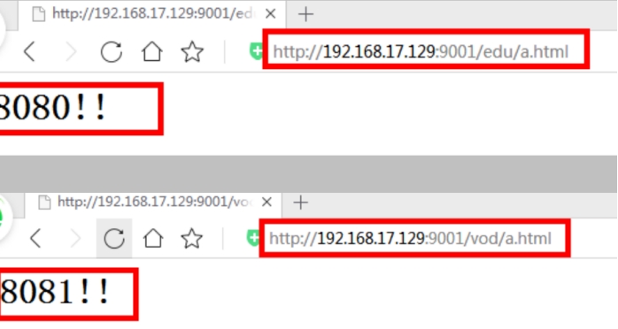

# [Nginx](https://www.cnblogs.com/LiuQizhong/p/11757420.html)

# **一、安装Nginx**

## **1、准备工作**

（1）打开虚拟机，使用远程连接工具连接 linux 操作系统

（2）到 nginx 官网下载软件

http://nginx.org/

## 2、开始进行 nginx 安装

### **（1）安装 pcre 依赖**

#### 第一步 联网下载 pcre 压缩文件依赖

```
wget http://downloads.sourceforge.net/project/pcre/pcre/8.37/pcre-8.37.tar.gz
```

 

#### 第二步 解压压缩文件

使用命令 tar –xvf pcre-8.37.tar.gz

#### 第三步./configure 完成后，回到 pcre 目录下执行 make，最后执行 make install

查看pcre依赖是否安装成功：pcre-config --version

### **（2）安装 openssl 、zlib 、 gcc 依赖**

```
yum -y install make zlib zlib-devel gcc-c++ libtool openssl openssl-devel
```

 

### **（3）安装 nginx**

\* 使用命令解压

\* ./configure

\* make && make install

进入目录 /usr/local/nginx/sbin/nginx 启动服务

**安装后，不能访问的，需要对防火墙进行设置**

**也可以直接关闭防火墙，并防止自启(在练习模式中)**

[](javascript:void(0);)

```
//关闭防火墙&&防火墙自启

systemctl stop firewalld && systemctl disable firewalld

//安装Iptables管理工具&&启动Iptables&&设为Iptables开机自启&&清空Iptables规则&&保存Iptables默认规则

yum -y install iptables-services && systemctl start iptables && systemctl enable iptables&& iptables -F && service iptables save 
```

[](javascript:void(0);)

①　查看开放的端口

firewall-cmd --list-all


②　设置开放的端口号

firewall-cmd --add-service=http –permanent

firewall-cmd --add-port=80/tcp --permanent

③　设置之后需要重启防火墙

firewall-cmd --reload


④　访问成功

 

# **二、Nginx常用命令**

进入 nginx 目录中: cd /usr/local/nginx/sbin

## **1、查看 nginx 版本号** 

./nginx -v

## **2、启动 nginx**

./nginx

查看是否启动成功：ps -ef|grep nginx


## **3、停止 nginx**

./nginx -s stop

## **4、重新加载 nginx**

./nginx -s reload

# **三、nginx.conf配置文件**

## **1、位置**

vim /usr/local/nginx/conf/nginx.conf

## **2、配置文件中的内容（包含三部分）**

### （1）全局块：配置服务器整体运行的配置指令

从配置文件开始到 events 块之间的内容，主要会设置一些影响 nginx 服务器整体运行的配置指令，主要包括配

置运行 Nginx 服务器的用户（组）、允许生成的 worker process 数，进程 PID 存放路径、日志存放路径和类型以

及配置文件的引入等。

比如上面第一行配置的：

这是 Nginx 服务器并发处理服务的关键配置，worker_processes 值越大，可以支持的并发处理量也越多，但是

会受到硬件、软件等设备的制约

 

### （2）events 块：影响 Nginx 服务器与用户的网络连接

events 块涉及的指令主要影响 Nginx 服务器与用户的网络连接，常用的设置包括是否开启对多 work process

下的网络连接进行序列化，是否允许同时接收多个网络连接，选取哪种事件驱动模型来处理连接请求，每个 word

process 可以同时支持的最大连接数等。

上述例子就表示每个 work process 支持的最大连接数为 1024.

这部分的配置对 Nginx 的性能影响较大，在实际中应该灵活配置。


 

### （3）http 块

这算是 Nginx 服务器配置中最频繁的部分，代理、缓存和日志定义等绝大多数功能和第三方模块的配置都在这里。

需要注意的是：http 块也可以包括 http 全局块、server 块。

 

#### ①、http 全局块

http 全局块配置的指令包括文件引入、MIME-TYPE 定义、日志自定义、连接超时时间、单链接请求数上限等。

 

#### ②、server 块

这块和虚拟主机有密切关系，虚拟主机从用户角度看，和一台独立的硬件主机是完全一样的，该技术的产生是为了

节省互联网服务器硬件成本。

每个 http 块可以包括多个 server 块，而每个 server 块就相当于一个虚拟主机。

而每个 server 块也分为全局 server 块，以及可以同时包含多个 locaton 块。

 

##### 全局 server 块

最常见的配置是本虚拟机主机的监听配置和本虚拟主机的名称或 IP 配置。

##### location 块

一个 server 块可以配置多个 location 块。

这块的主要作用是基于 Nginx 服务器接收到的请求字符串（例如 server_name/uri-string），对虚拟主机名称

（也可以是 IP 别名）之外的字符串（例如 前面的 /uri-string）进行匹配，对特定的请求进行处理。地址定向、数据缓

存和应答控制等功能，还有许多第三方模块的配置也在这里进行。

# **四、Nginx 反向代理实例 2**

## **1、实现效果**

打开浏览器，在浏览器地址栏输入地址 www.123.com，跳转到 liunx 系统 tomcat 主页

面中

## **2、准备工作**

### **（1）在 liunx 系统安装 tomcat，使用默认端口 8080**

\* tomcat 安装文件放到 liunx 系统中，解压

\* 进入 tomcat 的 bin 目录中，./startup.sh 启动 tomcat 服务器

### **（2）对外开放访问的端口** 

firewall-cmd --add-port=8080/tcp --permanent

firewall-cmd –reload

查看已经开放的端口号

firewall-cmd --list-all

### **（3）在 windows 系统中通过浏览器访问 tomcat 服务器**

## **3、访问过程的分析**

 

## **4、具体配置**

第一步 在 windows 系统的 host 文件进行域名和 ip 对应关系的配置

 

 

 

 

添加内容在 host 文件中

 

第二步 在 nginx 进行请求转发的配置（反向代理配置）

 

## **5、最终测试**

 

# **五、Nginx 反向代理实例 2**

## **1、实现效果**

使用 nginx 反向代理，根据访问的路径跳转到不同端口的服务中

nginx 监听端口为 9001，

访问 http://192.168.17.129:9001/edu/ 直接跳转到 127.0.0.1:8080

访问 http:// 192.168.17.129:9001/vod/ 直接跳转到 127.0.0.1:8081

## **2、准备工作**

（1）准备两个 tomcat 服务器，一个 8080 端口，一个 8081 端口

（2）创建文件夹和测试页面

## **3、具体配置**

（1）找到 nginx 配置文件，进行反向代理配置

 

（2）开放对外访问的端口号 9001 8080 8081

## **4、最终测试**

 

 

 

# **六、Nginx 配置实例-负载均衡**

## **1、实现效果**

（1）浏览器地址栏输入地址 http://192.168.17.129/edu/a.html，负载均衡效果，平均 8080

和 8081 端口中

## **2、准备工作**

（1）准备两台 tomcat 服务器，一台 8080，一台 8081

（2）在两台 tomcat 里面 webapps 目录中，创建名称是 edu 文件夹，在 edu 文件夹中创建

页面 a.html，用于测试

## **3、在 nginx 的配置文件中进行负载均衡的配置**

 

## **4、nginx 分配服务器策略**

### **第一种 轮询（默认）**

每个请求按时间顺序逐一分配到不同的后端服务器，如果后端服务器 down 掉，能自动剔除。

### **第二种 weight**

weight 代表权重默认为 1,权重越高被分配的客户端越多

 

### **第三种 ip_hash**

每个请求按访问 ip 的 hash 结果分配，这样每个访客固定访问一个后端服务器

 

### **第四种 fair（第三方）**

按后端服务器的响应时间来分配请求，响应时间短的优先分配。

 

# **七、Nginx 配置实例-动静分离**

## **1、什么是动静分离**

 

Nginx 动静分离简单来说就是把动态跟静态请求分开，不能理解成只是单纯的把动态页面和

静态页面物理分离。严格意义上说应该是动态请求跟静态请求分开，可以理解成使用 Nginx

处理静态页面，Tomcat 处理动态页面。动静分离从目前实现角度来讲大致分为两种，

一种是纯粹把静态文件独立成单独的域名，放在独立的服务器上，也是目前主流推崇的方案；

另外一种方法就是动态跟静态文件混合在一起发布，通过 nginx 来分开。

 

通过 location 指定不同的后缀名实现不同的请求转发。通过 expires 参数设置，可以使浏

览器缓存过期时间，减少与服务器之前的请求和流量。具体 Expires 定义：是给一个资源

设定一个过期时间，也就是说无需去服务端验证，直接通过浏览器自身确认是否过期即可，

所以不会产生额外的流量。此种方法非常适合不经常变动的资源。（如果经常更新的文件，

不建议使用 Expires 来缓存），我这里设置 3d，表示在这 3 天之内访问这个 URL，发送一

个请求，比对服务器该文件最后更新时间没有变化，则不会从服务器抓取，返回状态码 304，

如果有修改，则直接从服务器重新下载，返回状态码 200。

## **2、准备工作**

在 liunx 系统中准备静态资源，用于进行访问

 

## **3、具体配置**

在 nginx 配置文件中进行配置


## **4、最终测试**

（1）浏览器中输入地址

http://192.168.17.129/image/01.jpg

 

因为配置文件 autoindex on

 

重点是添加 location，

最后检查 Nginx 配置是否正确即可，然后测试动静分离是否成功，之需要删除后端 tomcat

服务器上的某个静态文件，查看是否能访问，如果可以访问说明静态资源 nginx 直接返回

了，不走后端 tomcat 服务器

# **八、nginx原理**

## 1、mater 和 worker

 

 

 

## 2、worker 如何进行工作的

## 

##  

## 3、一个 master 和多个 woker 有好处

（1）可以使用 nginx –s reload 热部署，利用 nginx 进行热部署操作

（2）每个 woker 是独立的进程，如果有其中的一个 woker 出现问题，其他 woker 独立的，

继续进行争抢，实现请求过程，不会造成服务中断

## 4、设置多少个 woker 合适

worker 数和服务器的 cpu 数相等是最为适宜的

## 5、连接数 worker_connection

第一个：发送请求，占用了 woker 的几个连接数？

答案：2 或者 4 个

 

第二个：nginx 有一个 master，有四个 woker，每个 woker 支持最大的连接数 1024，支持的

最大并发数是多少？

l 普通的静态访问最大并发数是： worker_connections * worker_processes /2，

l 而如果是 HTTP 作 为反向代理来说，最大并发数量应该是 worker_connections *

worker_processes/4。