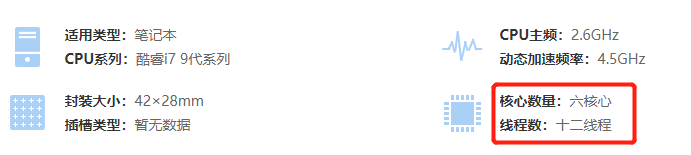
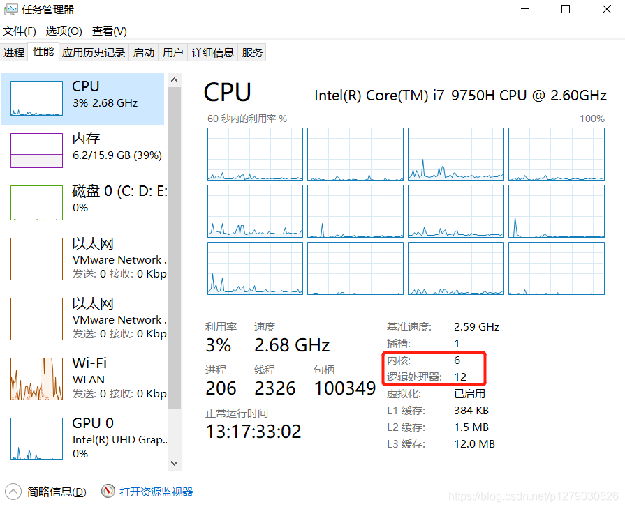
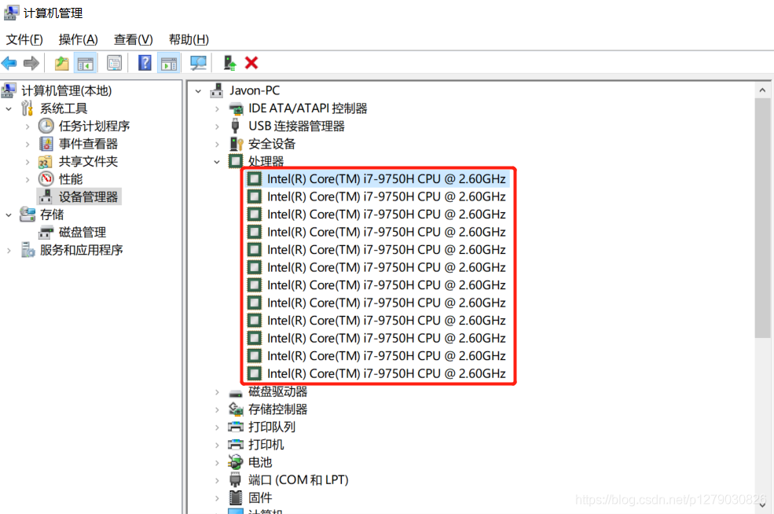

# VMWare中的处理器数量和每个处理器的内核数量概念及查询方法

### 一、概念：

> **处理器数量** ：虚拟的CPU颗数。
>
> **每个处理器的内核数量**：虚拟的CPU内核数。
>
> **处理器内核总数**：处理器内核总数 = 处理器数量 * 每个处理器的内核数量。

处理器内核总数 对应的是 物理CPU的线程数（逻辑处理器数量）。 

所以配置[虚拟机](https://so.csdn.net/so/search?q=虚拟机&spm=1001.2101.3001.7020)时，我们只需要关心 CPU实际的线程数 是多少就行了，即配置的 **处理器内核总数 < CPU实际的线程数** 就行了。

 

注：一个CPU有多个内核（单核/双核/四核/六核/八核），而一个内核一般对应一个线程，但通过Intel的超线程技术，一个核心可以对应两个线程，即可以同时运行两个线程，并行处理两个任务。

 

### 二、查看电脑配置参数方法：

1、网上查询对应的CPU参数

2、打开[任务管理器](https://so.csdn.net/so/search?q=任务管理器&spm=1001.2101.3001.7020)，“性能”界面。

内核：即CPU核心数。

逻辑处理器：即线程数。

3、"我的电脑"右键--“管理”--“设备管理器”

“处理器”项下面显示几条记录即代表有几个逻辑处理器（线程数）。

 

### 三、配置论证参考

**实际硬件参数**： 6核 12线程

**配置成功：**

**配置失败：**

 