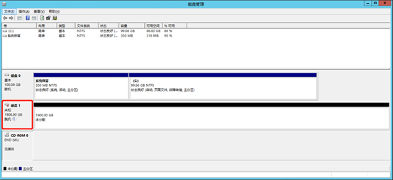
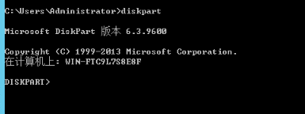
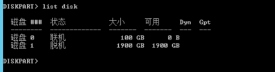
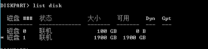
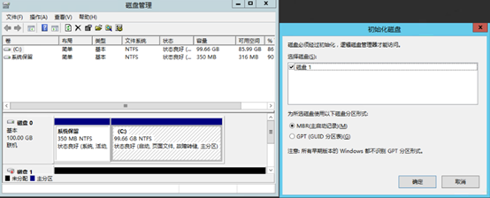

# windows server 新增磁盘处于脱机状态解决办法

 

 

解决方案：

Cmd命令行操作如下：

1，进入diskpart模式

 

 

 

2、列出磁盘情况

 

 

 

3、选择脱机的磁盘

 

 

 

4、联机磁盘

 

 

 

 

 

5、清除磁盘属性

 

 

 

6、进入磁盘管理，提示初始化

 

 

每天记录一点，就能多学一点,充实一点