# VMware Esxi网络配置

原文:

[VMware ESXi网络配置](https://blog.csdn.net/wxt_hillwill/article/details/119927089)

**目录**

[一、ESXi网络配置方法](#t0)

[二、虚拟机网络配置方法](#t1)

------

## **一、ESXi网络配置方法**

1、搭建完成ESXi平台后，即可为它设置系统IP。如下图，在此界面按F2，输入用户名密码后进入配置界面：

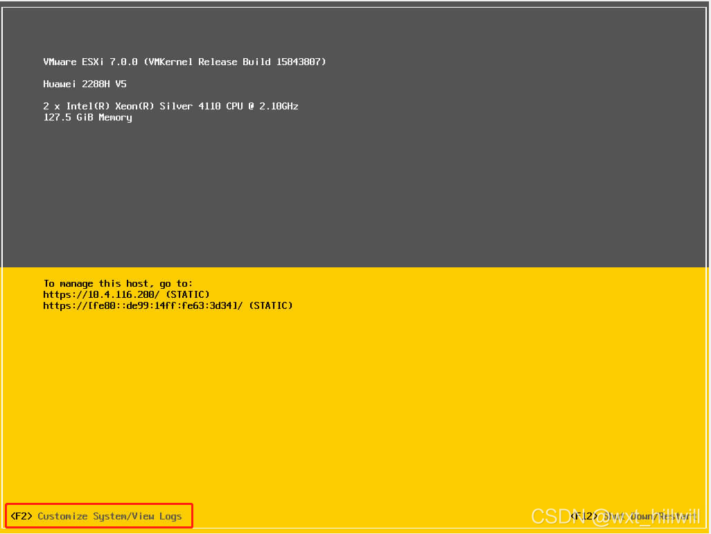

2、左侧菜单栏可以看到：

- Configure Management Network：配置管理网络
- Restart Management Network：重启管理网络
- Test Management Network：测试管理网络

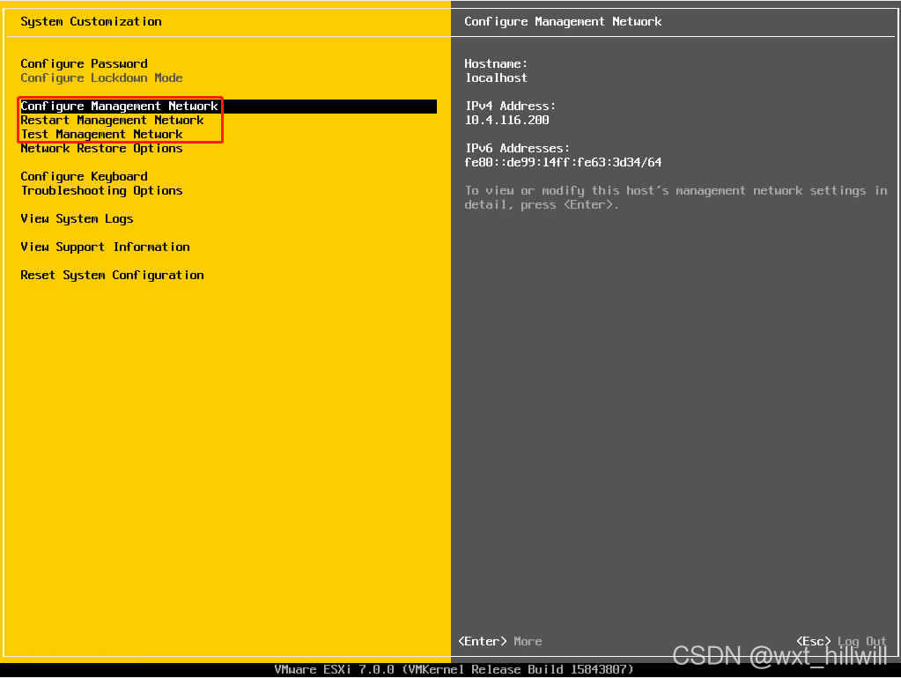

3、进入Configure Management Network，可以看到：

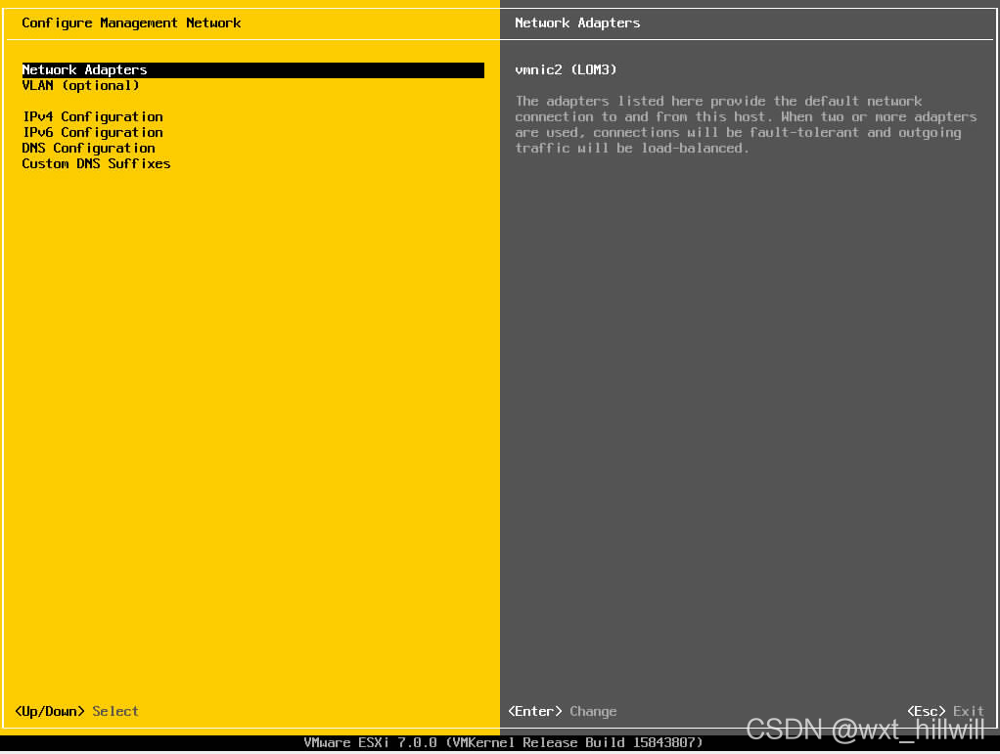

- Network Adapters：网络适配器，选择可用的物理网卡；

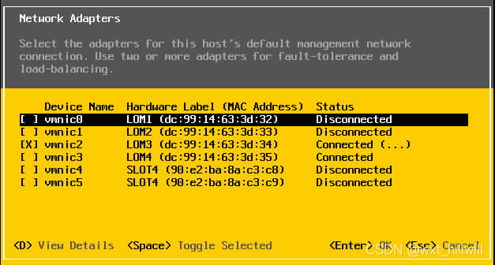

- VLAN（optional）：输入VLAN

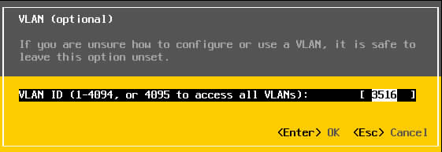

- IPv4 Configuration：配置IPv4网络；

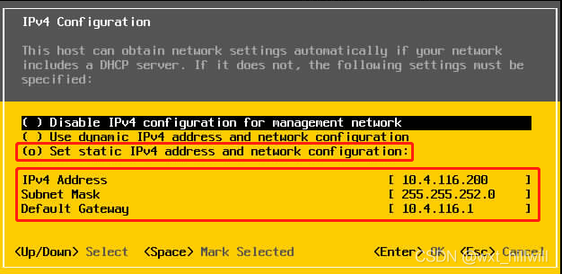

- DNS Configuration：配置DNS；
- IPv6 Configuration：如果需要可以配置IPv6网络；
- Custom DNS Suffixes：如果需要可以配置自定义DNS后缀；

4、保存好网络配置，Esc退出，再进入Restart Magagement Network界面重启网络。重启后平台的网络就能通了；

## **二、虚拟机网络配置方法**

1、登录平台的Web界面，在“网络”->“VMkernel网卡”界面就能看到刚才配置的Management Network。

​    VMkernel网络适配器是ESXi用来主机管理的，下图中vmk0的IP是10.4.116.200，也就是说我们可以通过这个IP（http://IP）访问这台ESXi和它里面的资源；

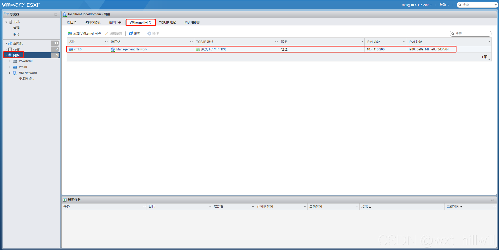

​    编辑一下vmk0，可以看到它有哪些配置项：

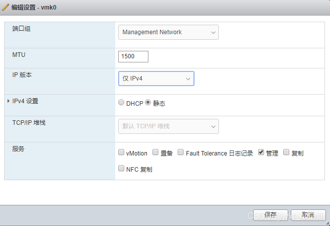

​    [VMware](https://so.csdn.net/so/search?q=VMware&spm=1001.2101.3001.7020)官网对这些配置项的解释如下：

- MTU：选择是从交换机获取网络适配器的 MTU，还是设置自定义大小。不能将 MTU 大小设置为一个大于 9000 字节的值。MTU指的是最大传输单元（Maximum Transmission Unit，MTU）是指一种通信协议在某一层上面所能通过的最大数据报大小（以字节为单位），它通常与链路层协议有密切的关系。
- TCP/IP堆栈：一共有三个选项（默认TCP/IP堆栈 、vMotion、 置备堆栈），如果选择 vMotion 或置备堆栈，则可用服务中只能使用 vMotion 或置备流量，而如果设置了置备 TCP/IP 堆栈，将可以使用所有可用服务。
- 可用服务：包括vMotion（允许 VMkernel 适配器向另一台主机播发声明，自己就是发送 vMotion 流量所应使用的网络连接）、置备（处理虚拟机冷迁移、克隆和快照迁移传输的数据）、Fault Tolerance日志记录、管理（流量管理）、复制（处理从源 ESXi 主机发送到 vSphere Replication 服务器的出站复制数据）和NFC复制（处理目标复制站点上的入站复制数据）。

2、在“网络”->“物理网卡”界面看到物理设备上所有的网卡；

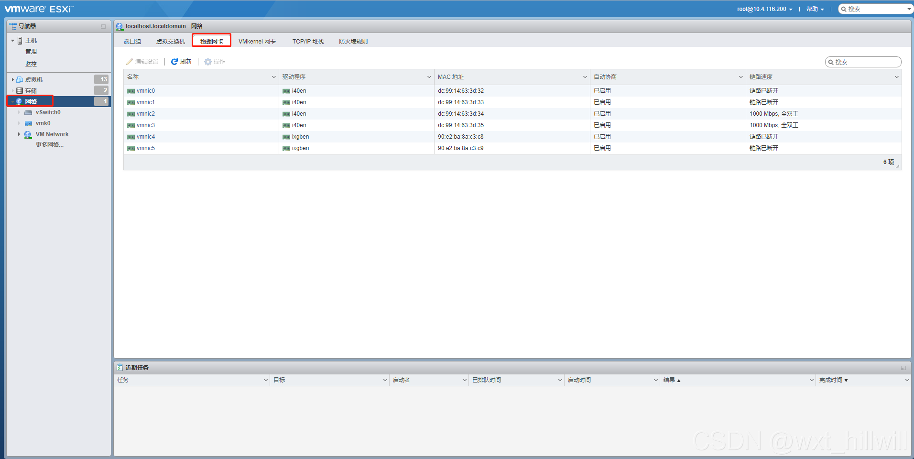

- 名称：物理网卡简称vmnic，ESXi内核的第一块称为vmnic0，第二块称为vmnic1。
- 驱动程序：因为物理网卡是一个硬件设备，所以需要有对应的驱动程序。接着驱动程序向操作系统内核注册该网卡设备，从而让内核识别该物理网卡。
- MAC地址：MAC地址是一个是一个用来确认网络设备位置的位址，用于在网络中唯一标示一个[网卡](https://baike.baidu.com/item/网卡)，一台设备若有一或多个网卡，则每个网卡都需要并会有一个唯一的MAC地址。
- 自动协商：自动协商模式是端口根据另一端设备的连接速度和双工模式，自动把它的速度调节到最高的公共水平，即线路两端能具有的最快速度和双工模式。
- 链路速度：“链路已断开”说明此网口未接网线或不可用，“1000 Mpbs”可以判断该网口是一个千兆网口（下图可以看到这个环境中vmnic2、vmnic3是可用的网口，且均为千兆网口），“10000 Mpbs”可以判断该网口是一个万兆网口。
- 全双工：是指在发送数据的同时也能够接收数据，两者同步进行；而半双工刚好相反，同一时间只能发送或接收数据，两者不能同步进行。

3、接下来是“虚拟交换机”的界面。下图中的vSwitch0是安装成功之后界面上就会出现的，如果需要还可以配置其他的虚拟交换机：

​    虚拟交换机，简称vSwitch，由ESXi内核提供，用于确保虚拟机和管理界面之间的相互通信。其功能与物理交换机相似。物理机通过网线或光纤连接到物理交换机的端口，而虚拟机通过虚拟网卡连接到虚拟交换机的虚拟端口。

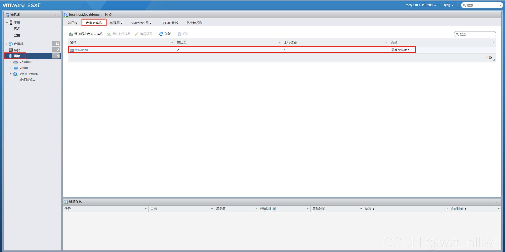

​    编辑一下vSwitch0，可以看到这里有个“添加上行链路”的按钮，意思就是说可以在这里添加多个上行链路以达到故障冗余的效果：

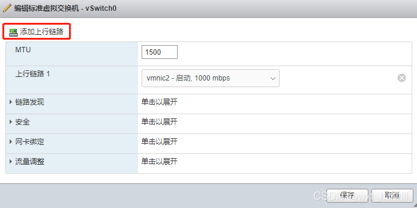

4、最后是“端口组”的界面，Management Network端口组是配置好步骤1~4之后就会生成的，VM Network端口组是我新建的，专门用于连接ESXi主机内虚拟机间的通讯，一个虚拟机必须连接到一个端口组（并且不能使用Management Network，必须新建一个或多个给虚拟机使用），已达到通过主机的物理网卡与外部通讯的效果，端口组无不需要地址。

​    这里的Management Network就是物理网络。物理网络是为了使物理服务器之间能够正常通信而建立的网络。

​    VM Network是虚拟网络，虚拟网络是在ESXi主机上运行的虚拟机为了互相通信而逻辑连接形成的网络。

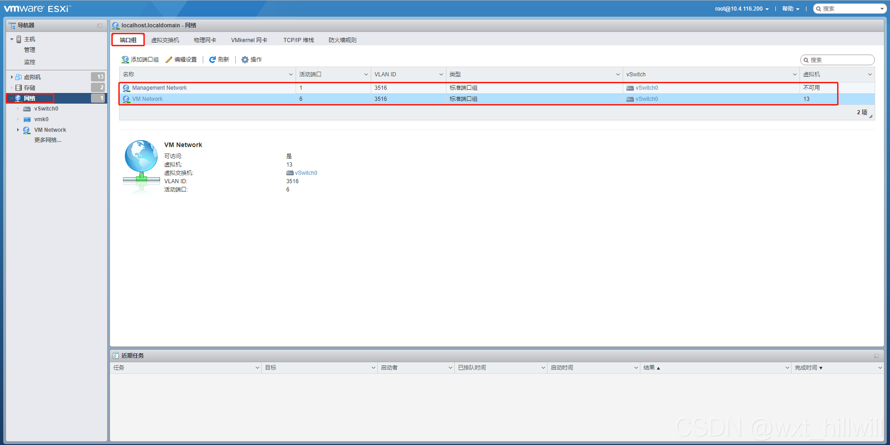

​    点进去可以看到VM Network的详情，虚拟交换机直使用了vSwitch0，然后安全、网卡绑定、流量调整全部从vSwitch继承下来：

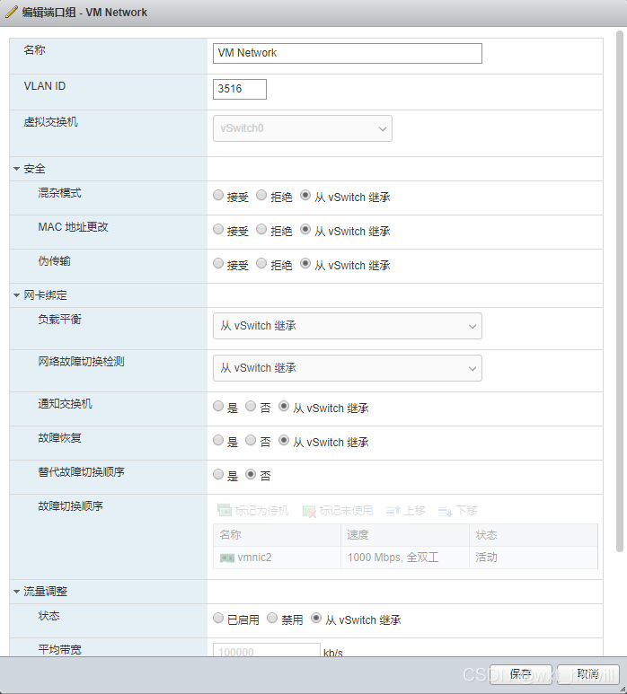

​    然后我们就可以用这个VM Network端口组为虚拟机配置网络适配器，首先右键“虚拟机”，选择“创建/注册虚拟机”：

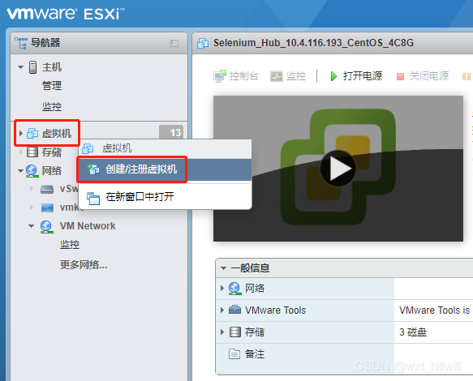

​     然后在第四步自定义设置中，网络适配器选择VM Network：    

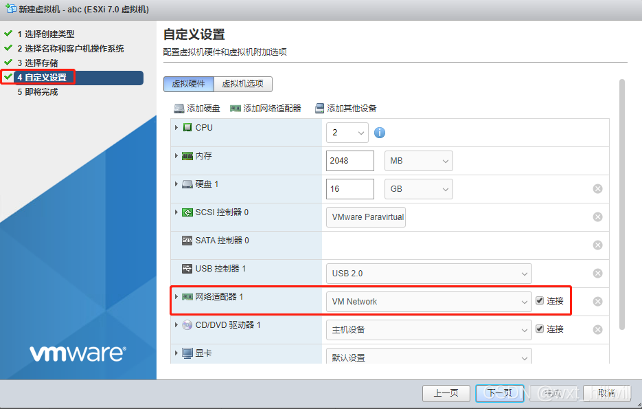

​     虚拟机创建完成，安装好系统后，就可以为它设置IP、[网关](https://so.csdn.net/so/search?q=网关&spm=1001.2101.3001.7020)、掩码、DNS了。配置好即可ping通。