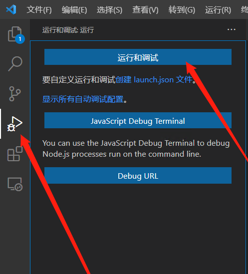
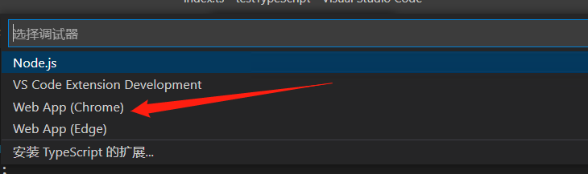
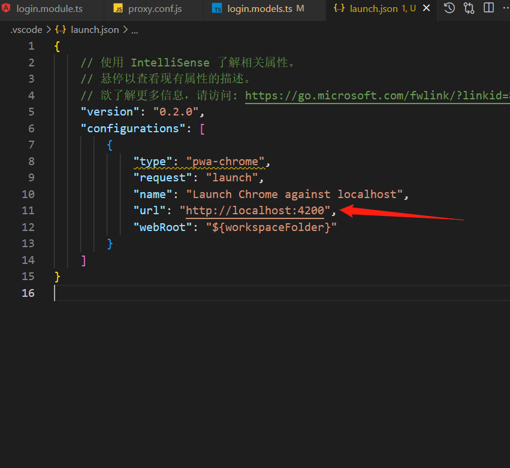
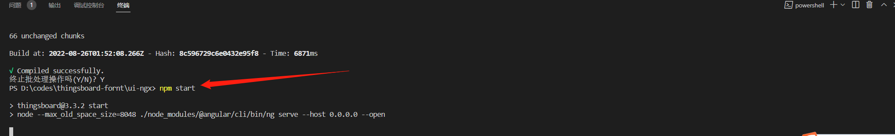
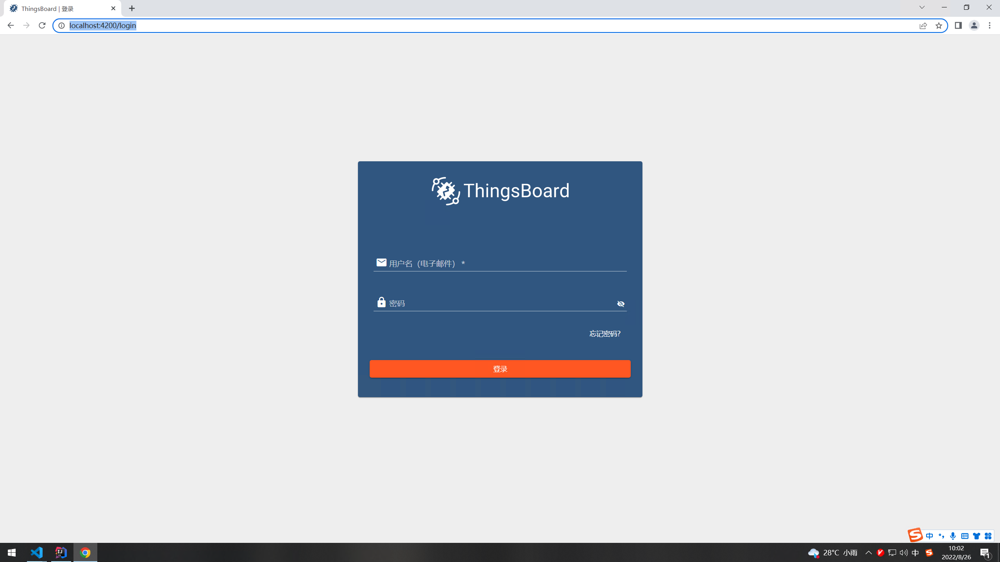
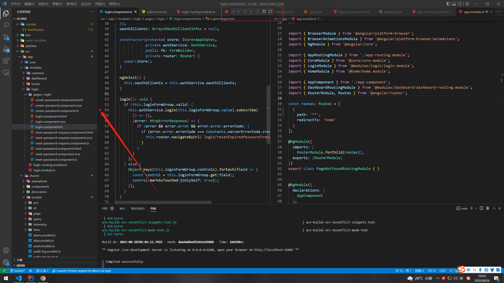
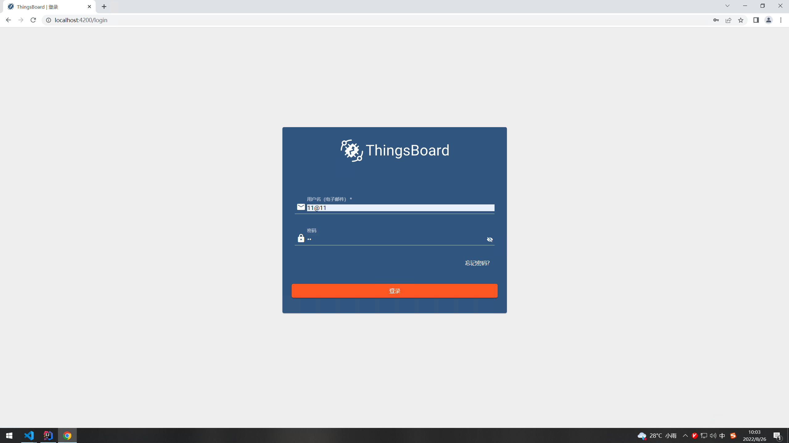
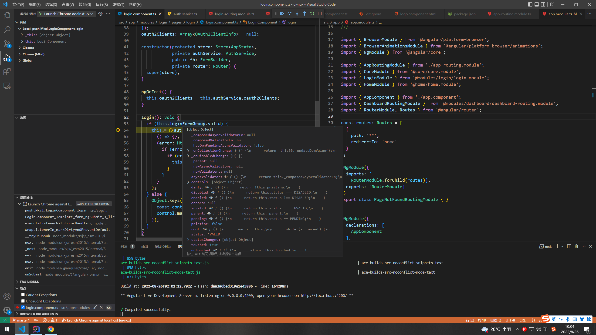

# vscode调试thingsboard前端程序






修改需要调试的前端路由



```json
{
  // For more information, visit: https://go.microsoft.com/fwlink/?linkid=830387
  "version": "0.2.0",
  "configurations": [
  {
    "name": "Launch Chrome",
    "request": "launch",
    "type": "chrome",
    "url": "http://localhost:4200",
    "webRoot": "${workspaceFolder}"
  }
  ]
}
```

启动thingsboard



等待启动完成，关掉npm start命令里面自动打开的浏览器窗口

按F5，vscode会自动为我们打开一个浏览器窗口



打个断点





