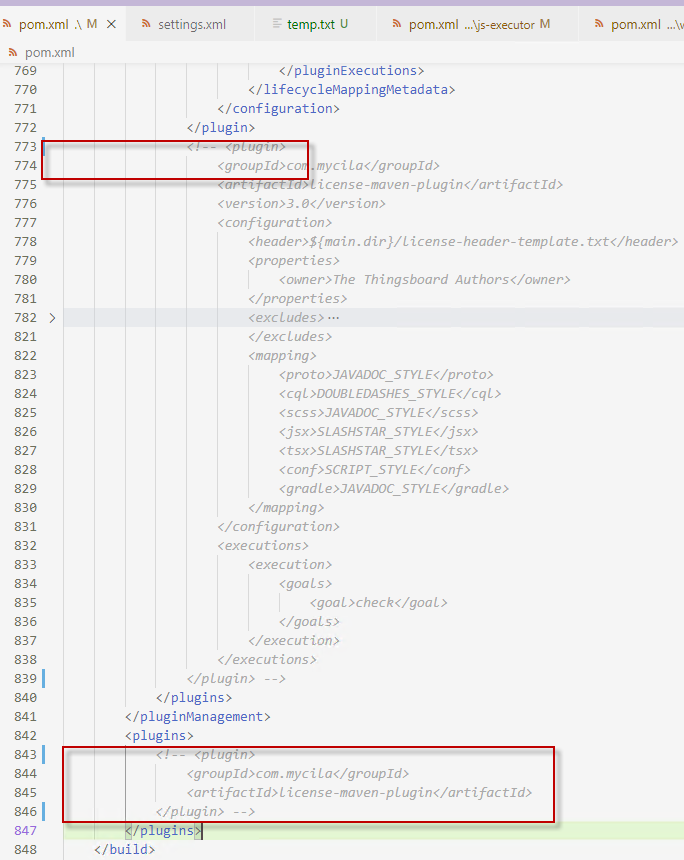

# thingsboard win10编译运行

参考链接：

[thingsboard编译-windows版本](https://blog.csdn.net/flystreet7/article/details/120858082)

[thingsboard编译闭坑指南](https://www.codeleading.com/article/47066285401/)

## 准备

首先需要安装下面的这些

1. JDK
2. Maven
3. nvm
4. node：版本对应上thingsboard/ui-ngx/pom.xml下的版本
5. yarn：版本对应上thingsboard/ui-ngx/pom.xml下的版本
6. git：配置好ssh秘钥，username，email，确保可以和github连上
7. <span style="background-color:yellow">准备个梯子，设置成全局模式，不要用代理和软路由</span>

## 环境需要注意的点

### nvm use node版本号会报错

解决方法：用管理员权限打开，cmd

### git连接不上，下载某些依赖出错

```
git config --global url."https://".insteadOf git://
```

### maven镜像

多配一点，牛逼

```
  <mirror>
      <id>central</id>
      <name>aliyun central</name>
      <url>https://maven.aliyun.com/repository/central</url>
      <mirrorOf>central</mirrorOf>
    </mirror>
    <mirror>
      <id>google</id>
      <name>aliyun google</name>
      <url>https://maven.aliyun.com/repository/google</url>
      <mirrorOf>google</mirrorOf>
    </mirror>
    <mirror>
      <id>public</id>
      <name>aliyun public</name>
      <url>https://maven.aliyun.com/repository/public</url>
      <mirrorOf>public</mirrorOf>
    </mirror>
    <mirror>
      <id>gradle-plugin</id>
      <name>aliyun gradle-plugin</name>
      <url>https://maven.aliyun.com/repository/gradle-plugin</url>
      <mirrorOf>gradle-plugin</mirrorOf>
    </mirror>
    <mirror>
      <id>spring</id>
      <name>aliyun spring</name>
      <url>https://maven.aliyun.com/repository/spring</url>
      <mirrorOf>spring</mirrorOf>
    </mirror>
    <mirror>
      <id>spring-plugin</id>
      <name>aliyun spring-plugin</name>
      <url>https://maven.aliyun.com/repository/spring-plugin</url>
      <mirrorOf>spring-plugin</mirrorOf>
    </mirror>
    <mirror>
      <id>grails-core</id>
      <name>aliyun grails-core</name>
      <url>https://maven.aliyun.com/repository/grails-core</url>
      <mirrorOf>grails-core</mirrorOf>
    </mirror>
    <mirror>
      <id>apache-snapshots</id>
      <name>aliyun apache-snapshots</name>
      <url>https://maven.aliyun.com/repository/apache-snapshots</url>
      <mirrorOf>apache-snapshots</mirrorOf>
    </mirror>
    <mirror>
      <id>nexus-public-snapshots</id>
      <mirrorOf>public-snapshots</mirrorOf>
      <url>http://maven.aliyun.com/nexus/content/repositories/snapshots/</url>
    </mirror>
    <mirror>
      <id>nexus</id>
      <name>internal nexus repository</name>
      <url>https://repo.maven.apache.org/maven2</url>
      <mirrorOf>central</mirrorOf>
    </mirror>

    <mirror>
      <id>maven-central</id>
      <name>central</name>
      <url>https://repo1.maven.org/maven2/</url>
      <mirrorOf>central</mirrorOf>
    </mirror>

    <mirror>
      <id>uk</id>
      <mirrorOf>central</mirrorOf>
      <name>Human Readable Name for this Mirror.</name>
      <url>http://uk.maven.org/maven2/</url>
    </mirror>

    <mirror>
      <id>CN</id>
      <name>OSChina Central</name>
      <url>http://maven.oschina.net/content/groups/public/</url>
      <mirrorOf>central</mirrorOf>
    </mirror>
```

### npm，yarn换源

```
# 安装
npm i -g yrm
# 列出可用源
yrm ls
# 换源
yrm use 源的名字
# 测试源延迟
yrm test
```

### 在C:\Users\用户名下创建pkg-cache文件夹

<span style="background-color:yellow">要是创建不了，可以在外面创建好，然后移动进去</span>

pkg-cache下创建v2.6文件夹，下载uploaded-v2.6-node-v12.18.1-win-x64和uploaded-v2.6-node-v12.18.1-linux-x64并改名为fetched-v12.18.1-win-x64和fetched-v12.18.1-linux-x64。（因为在编译UI-ngx时会扫描，如果没有则会帮你下载但是从github上下载很慢可能会导致编译失败）
下载地址：https://github.com/vercel/pkg-fetch/releases?q=&expanded=true

### <span style="background-color:yellow">如果遇到UI-ngx相关的编译不通过，先在该目录下执行yarn install再编译试试</span>

```
cd 到那个目录
yarn install
```

## 编译

```
# 下载
git clone thingsboard仓库地址
# reset remote
git remote set-url origin https://github.com/thingsboard/thingsboard.git
# 查看分支
git brach -a
# 切换到需要编译的版本 前面的是自己定义的名字 后面的是远程仓库的名字
git checkout -b release-3.2 origin/release-3.2

```

### **注释license-maven-plugin**

打开根目录pom.xml,搜索注释掉 license-maven-plugin 整个<plugin></plugin> ,两个地方需要注释，如下图所示



编译命令

```
mvn clean package -DskipTests
或者
mvn clean install -DskipTests
```

### 第一次编译的话，习惯先编译一下这个模块，因为它第一次编译太慢了。（可选）

```
cd xxx/thingsboard/ui-ngx

mvn clean package -DskipTests
```

### 整体编译

```
cd xxx/thingsboard

mvn clean package -DskipTests
```

