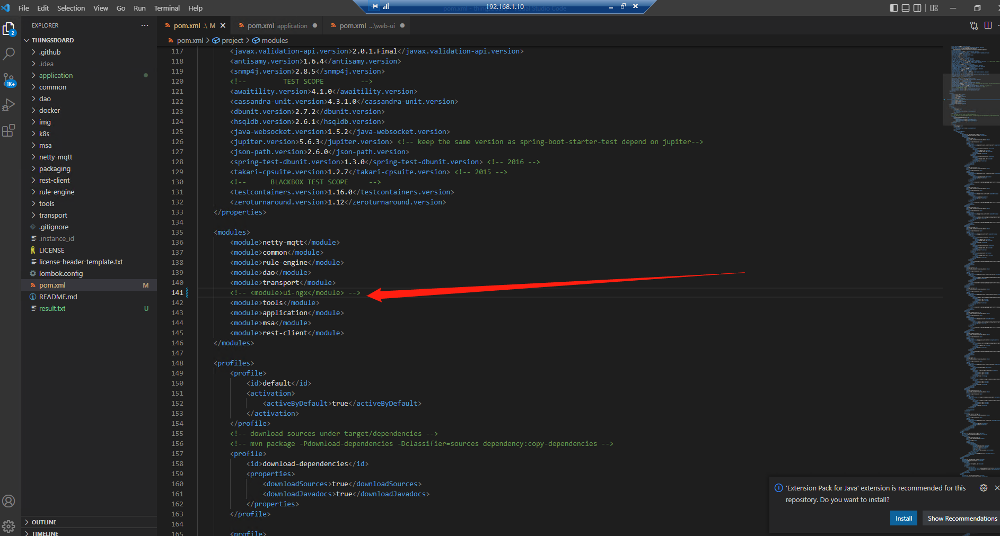
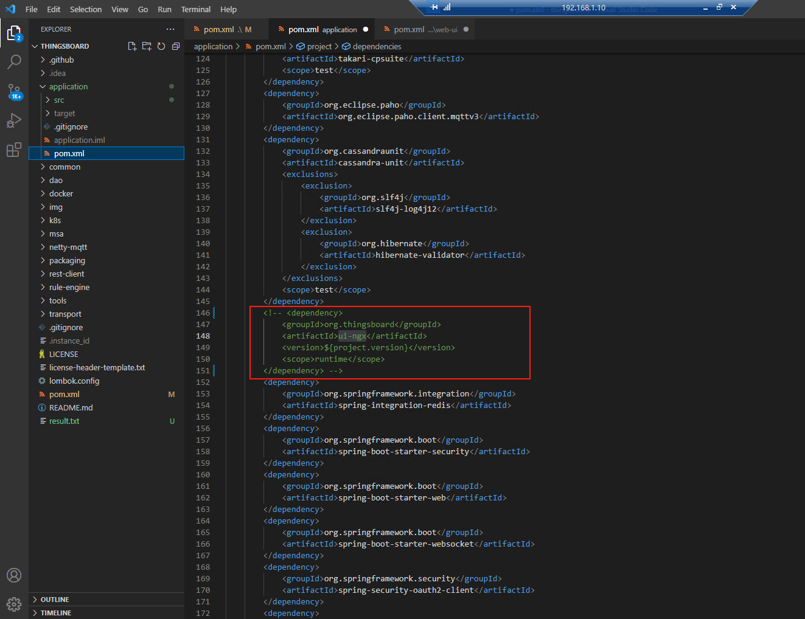
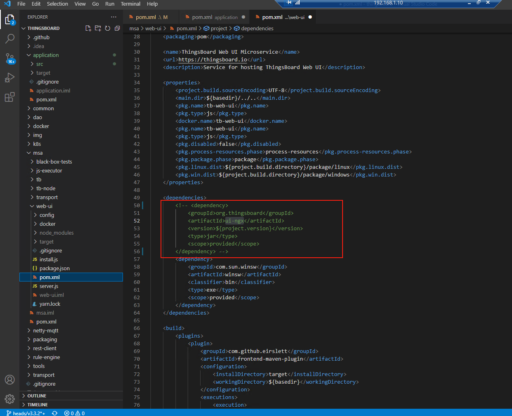
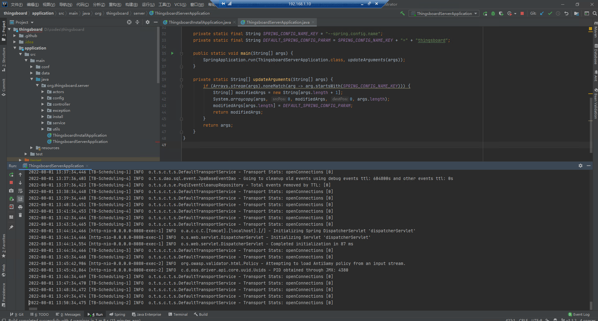
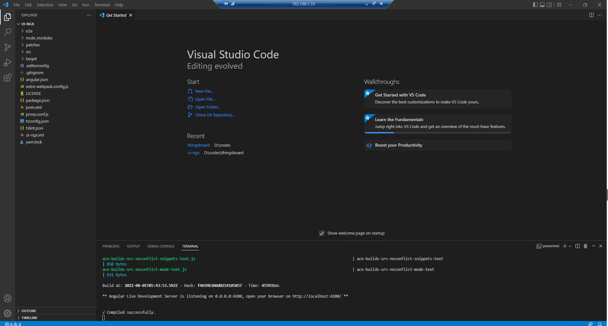
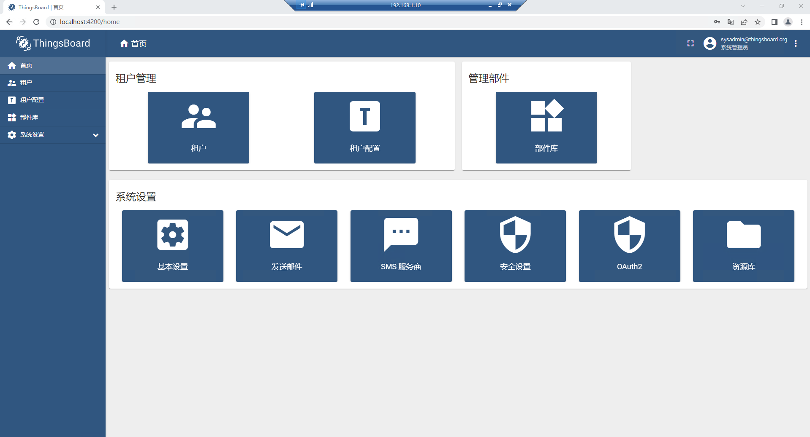

# Thingsboard 前后端分离方法

## 1、剪切ui-ngx前端项目到另外一个目录

## 2、注释掉项目中含有ui-ngx的部分

### 1）根目录下

### 2）application目录下

### 3）msa目录下

msa目录下Pom.xml还有一个ui-ngx我没注释

## 3、启动后端项目和前端项目

yarn start启动前端项目

## 4、结果

