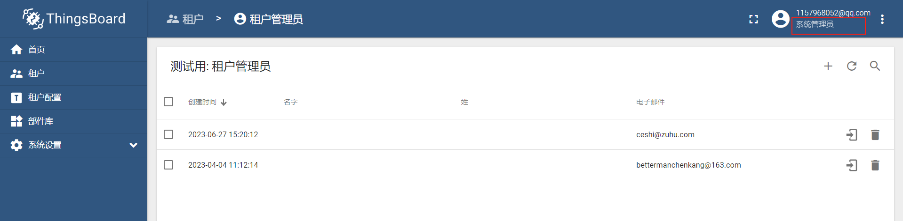
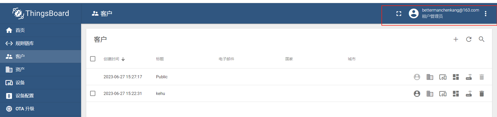
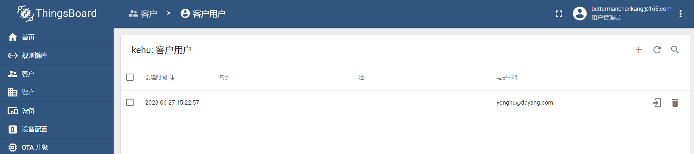

# TB的多租户

分为超级管理员，租户管理员，客户，和用户四个部分。

超级管理员：默认的是sysadmin@thingsboard.com ==可以登录==

租户管理员：在超级管理员下面创建租户后可以添加租户管理员。==可以登录==

客户：租户管理员下面可以建客户，客户又可以建用户，==客户是没办法登录的==。客户才是具体的资产。

用户：用户可以登录，用户是客户具体的人，==可以登录==。

## 租户管理员

在超级管理员账号下建的。

## 客户

在租户管理员下建的。

## 用户

在租户管理员，客户的菜单下面建的。

