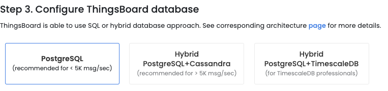

# 数据持久化/数据清洗策略                                        
 

# 介绍

ThingsBoard中通过`TTL功能`Time To Live 的缩写，指数据生存时间，来实现数据持久化策略。
在官方文档中也有多出介绍，比如：

- [租户配置](https://thingsboard.io/docs/user-guide/tenant-profiles/)可以指定租户级别的默认储存TTL天数。
- [Save Timeseries节点](https://thingsboard.io/docs/user-guide/rule-engine-2-0/action-nodes/#save-timeseries-node)可以指定单条遥测消息的有效时间。
- [ThingsBoard配置文件](https://thingsboard.io/docs/user-guide/install/config/)中可以指定系统级别的数据有效期。
- 服务端属性指定租户，客户级别的数据有效期。
   

# 支持TTL的数据

根据[官网介绍](https://thingsboard.io/docs/user-guide/install/config/#thingsboardconf)可以知道在ThingsBoard中支持TTL的数据如下：可以分别配置数据生存时间TTL

1. 时间序列数据。
2. 事件。
3. 调试事件。

根据级别又可以分为下面几种：（优先级从低到高排列，同时设置的情况下，高优先级覆盖低优先级）

1. 系统级别
2. 租户级别
3. 客户级别
4. 租户配置级别
5. `Save Timeseries节点`级别
6. 消息元数据级别
    

# 疑问

上面提到的介绍，相信大多数正在使用ThingsBoard的开发者已经都了解了。
但是实际应用还是有很多疑问的：

1. `Save Timeseries节点`配置了TTL怎么不起作用呢？
2. TTL相关参数之前没有配置，现在加上，会影响之前的数据吗？
3. 级别那么多，有时候配置好了并没有按上面描述的级别生效啊？
4. 很多时候官网关于TTL功能的介绍和实际使用对不上，怎么回事呢？

接下来分别介绍每种级别TTL的具体使用方法和需要注意的各种细节，然后通过测试案例证明。
 

# 支持情况

安装ThingsBoard数据库的时候，相信大家都看过官网文档的安装教程

三种安装方式下，遥测数据分别储存在postgresql,Cassandra,TimescaleDB(适用于TimescaleDB专业人员，本文不讲，看源码它的TTL实现机制和PostgreSQL类似)

1. 如果数据库选择第一种PostgreSQL，历史遥测存在postgresql的ts_kv表   
   1. 此时：TTL只支持级别1/3/4。（具体参考前面的级别）
2. 如果数据库选择第二种PostgreSQL+Cassandra，历史遥测存在cassandra的ts_kv_cf表   
   1. 此时：TTL支持所有级别1/2/3/4/5/6。（具体参考前面的级别）

说明：PostgreSQL和Cassandra的TTL实现方式不同，PostgreSQL是根据配置定时调用存储过程清理过期数据，Cassandra天生支持。所以能实现的粒度粗细不同。