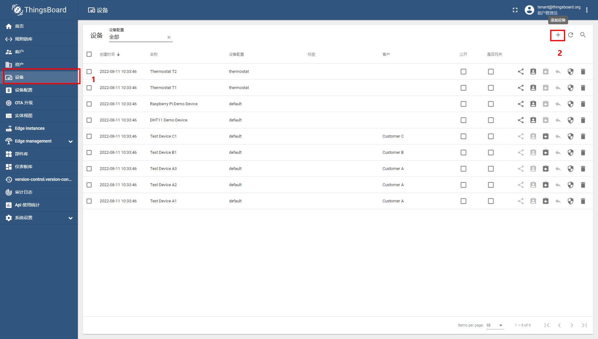
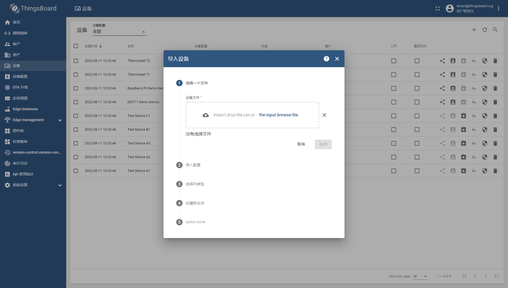
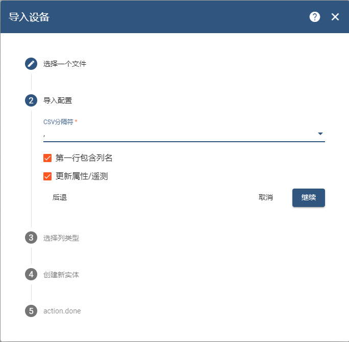
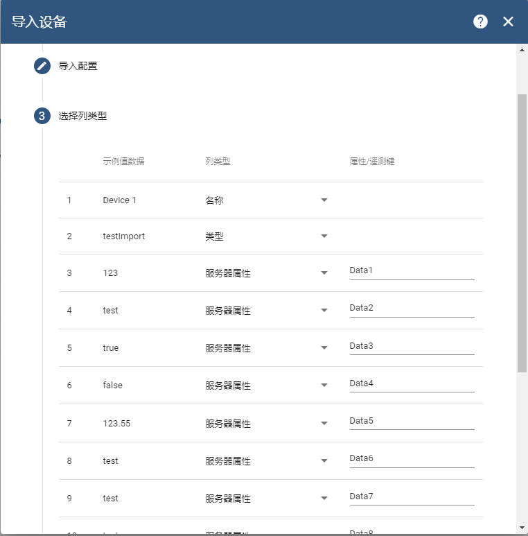
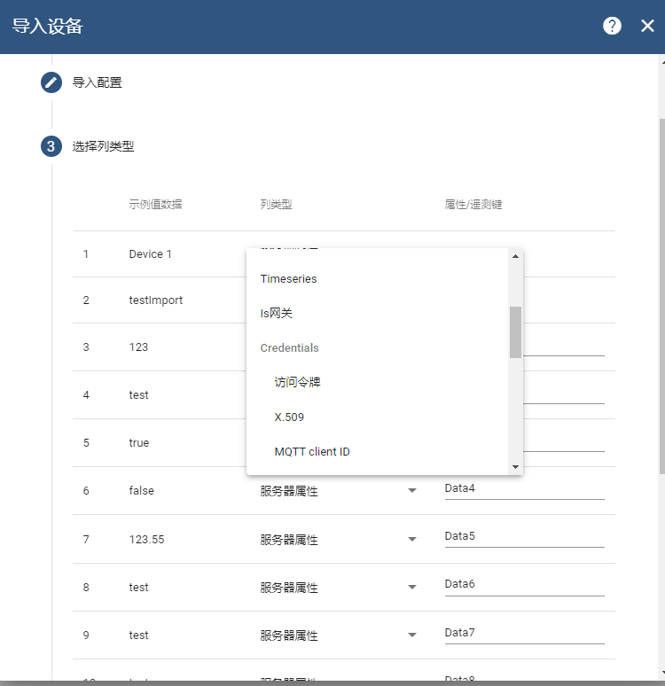
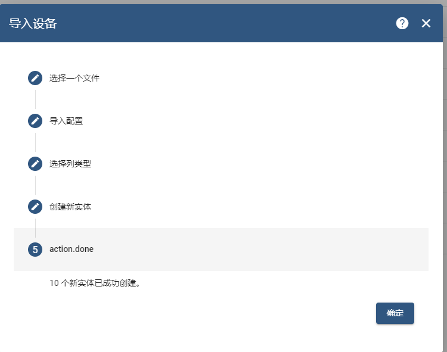
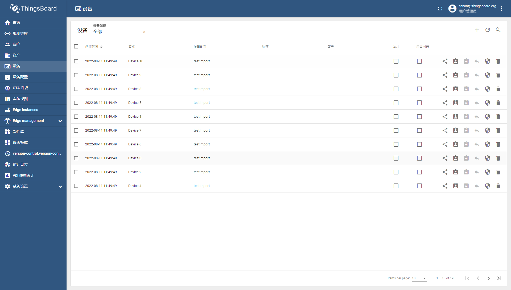
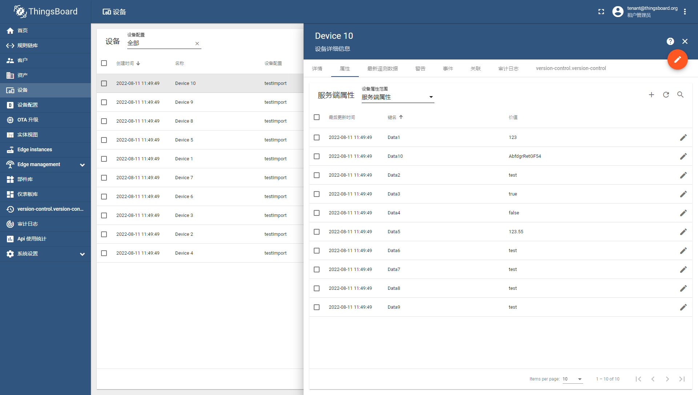

​                                            

## **背景** 

在真实的物联网场景中，实施人员经常会遇到这样的情况：一栋大厦里需要安装200个摄像头，如果这200个设备的数据需要我们一个一个地录入系统，那将非常耗时耗力。设备录入后还要拿到设备的token给到设备端。所幸在[thingsboard](https://so.csdn.net/so/search?q=thingsboard&spm=1001.2101.3001.7020)中我们可以使用导入设备这个功能来进行导入设备的所有数据。下面我就给大家介绍一下如何使用tb的设备导入来大批量录入设备数据。

## **导入流程** 

### 安装tb3.4

本案例使用thingsboard 3.4版本来演示
 安装tb3.4可以使用下面命令

```bash
docker run -d -p 9090:9090 -p 1883:1883 -p 7070:7070 --name my34tbp --restart always thingsboard/tb-postgres:3.4.0
```

### 导入流程

使用租户管理员登录系统，
 账号密码 tenant@thingsboard.org / tenant

打开设备菜单页面
 

点击右上角的加号，选择导入设备
 点击后会弹出导入的弹窗
 
 导入的文件要求是 `csv`格式或 `txt`格式

### 导入的设备数据示例

这里有一个 已经做好的设备数据

```cs
name,type,Data1,Data2,Data3,Data4,Data5,Data6,Data7,Data8,Data9,Data10
Device 1,testImport,123,test,TRUE,FALSE,123.55,test,test,test,test,AbfdgrRetGF45
Device 2,testImport,123,test,TRUE,FALSE,123.55,test,test,test,test,AbfdgrRetGF46
Device 3,testImport,123,test,TRUE,FALSE,123.55,test,test,test,test,AbfdgrRetGF47
Device 4,testImport,123,test,TRUE,FALSE,123.55,test,test,test,test,AbfdgrRetGF48
Device 5,testImport,123,,TRUE,FALSE,123.55,test,test,test,test,AbfdgrRetGF49
Device 6,testImport,123,test,TRUE,FALSE,123.55,test,test,test,test,AbfdgrRetGF50
Device 7,testImport,123,test,TRUE,FALSE,123.55,test,test,test,test,AbfdgrRetGF51
Device 8,testImport,123,test,TRUE,FALSE,123.55,test,test,test,test,AbfdgrRetGF52
Device 9,testImport,123,test,TRUE,FALSE,123.55,test,test,test,test,AbfdgrRetGF53
Device 10,testImport,123,test,TRUE,FALSE,123.55,test,test,test,test,AbfdgrRetGF54
```

可以看到第一行是属性名称，第二行开始是设备的数据。

选择文件后点击继续，进入导入配置的表单项
 
 这里有三个选择，一个是`csv`的分隔符，一共支持 四种分隔符，分别是`,` ，`;` ， `|`， `Tab`。

如果数据的第一行是列名，就需要勾选 第一行包含列名。

点击继续进行下一步，配置选择列类型。
 
 每一列的类型都是可以选择列的类型的。
 列的类型有很多。你可以将某一列 设置为设备的访问令牌。
 

设置完成后，就点击继续，创建实体。
 完成
 

可以看到导入的设备已经被搜索出来了
 

属性值也是刚刚导入的一些列的值。
 

点击[这里](https://thingsboard.io/docs/user-guide/bulk-provisioning/)可以看到更多有关设备导入的解释

其他资产导入与之相似。