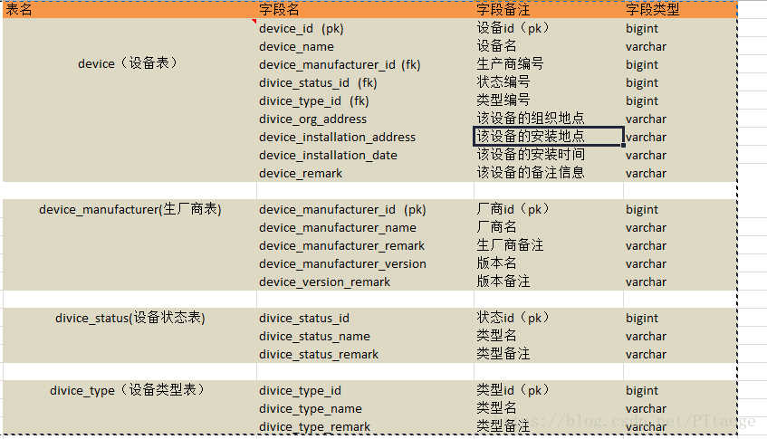

# [维度表，实体表，事实表之间的关系](https://www.cnblogs.com/itboys/p/10638665.html)

 这段时间在慢慢学习有关维度建模的一些东西，其中有个问题当时被老大挖了个坑就跳了进去几天都没爬出来，这个坑主要在于我对维度表，实体表，事实表这三种表之间的关系和概念认知比较模糊，当时老大要我去设计一个关于设备的维度和事实表及实体表出来时，结果我就真的去傻乎乎的对设备进行各种维度表和事实表的设计，然后在给老大看的时候各种被怼，最后才认知到设备怎么可能设计的出一个维度表呢，它本身就是一个客观存在的事实，我们是不可能去把一个客观存在的事实做成一个维度去分析的，维度建模中只存在通过各种维度去分析一个事实，而不能通过别的事实角度去分析另一个事实，如果存在这种结构，也应该是指标值（度量值）而不是一个维度。

​    维度表：维度表可以看成是用户用来分析一个事实的窗口，它里面的数据应该是对事实的各个方面描述，比如时间维度表，它里面的数据就是一些日，周，月，季，年，日期等数据，维度表只能是事实表的一个分析角度。

​    实体表：实体表就是一个实际对象的表，实体表它放的数据一定是一条条客观存在的事物数据，比如说设备 ，它就是客观存在的，所以可以将其设计一个实体表。

​    事实表：事实表其实质就是通过各种维度和一些指标值得组合来确定一个事实的，比如通过时间维度，地域组织维度，指标值可以去确定在某时某地的一些指标值怎么样的事实。事实表的每一条数据都是几条维度表的数据和指标值交汇而得到的。

 

  上面这张图就是设备表的一个实体表设计，它作为一个客观存在的事实它是无法建立一个维度表的，其实设备表本身也可以看成是一个事实表，只需要对生厂商，设备类型，时间，地点这几个点进行维度表设计就行了，这样就将一个设备表变成一个事实表了。

可能由于我本身对维度建模的接触时间比较短，在加上表达能力也不怎么行，对这三种关系理解的也不是很透切，导致文中对这三种表的关系及含义的描述可能会有错误或歧义，希望大家帮我指出，维度建模中的一个小白敬上。