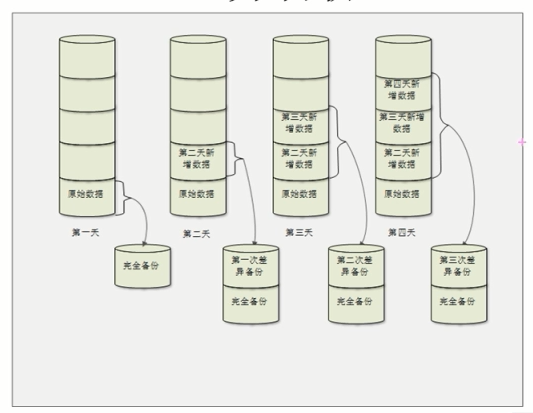

# 服务器备份

## 数据备份策略

[数据备份](https://baike.baidu.com/item/数据备份/10510214)策略选择了存储备份[软件](https://baike.baidu.com/item/软件/12053)、存储备份技术（包括存储备份硬件及存储备份介质）后，首先需要确定数据备份的策略。备份策略指确定需备份的内容、备份时间及备份方式。各个单位要根据自己的实际情况来制定不同的备份策略。被采用最多的备份策略主要有以下三种。

### 1、完全备份（fullbackup）

每天对自己的系统进行完全备份。例如，星期一用一盘磁带对整个系统进行备份，星期二再用另一盘磁带对整个系统进行备份，依此类推。这种备份策略的好处是：当发生数据丢失的灾难时，只要用一盘磁带（即灾难发生前一天的备份磁带），就可以恢复丢失的数据。然而它亦有不足之处，首先，由于每天都对整个系统进行完全备份，造成备份的数据大量重复。这些重复的数据占用了大量的磁带空间，这对用户来说就意味着增加成本。其次，由于需要备份的数据量较大，因此备份所需的时间也就较长。对于那些业务繁忙、备份时间有限的单位来说，选择这种备份策略是不明智的。

​	把所有需要备份的数据全部备份，完全备份可以备份整块硬盘，整个分区或某个具体的目录，这种方式**备份速度比较慢，耗费系统资源 ，**需要**占用比较多的硬盘空间**，但是**恢复起来比较方便**

### 2、增量备份(incrementalbackup)

速度快，节省硬盘空间，但是恢复起来比较麻烦

星期天进行一次完全备份，然后在接下来的六天里只对当天新的或被修改过的数据进行备份。这种备份策略的优点是节省了磁带空间，缩短了备份时间。但它的缺点在于，当灾难发生时，数据的恢复比较麻烦。例如，系统在周三的早晨发生故障，丢失了大量的数据，那么在周三当天就要将系统恢复到周二晚上时的状态。这时系统管理员就要首先找出星期天的那盘完全备份磁带进行系统恢复，然后再找出星期一的磁带来恢复星期一的数据，然后找出星期二的磁带来恢复星期二的数据。很明显，这种方式很繁琐。另外，这种备份的可靠性也很差。在这种备份方式下，各盘磁带间的关系就象链子一样，一环套一环，其中任何一盘磁带出了问题都会导致整条链子脱节。比如在上例中，若星期二的磁带出了故障，那么管理员最多只能将系统恢复到星期一晚上时的状态。

### 3、差异备份(differentialbackup) 又叫 差分备份

​	这是一个折中的策略，每次都跟原始数据比较，把存在差异性的数据进行备份，**但是这种方式用得并不多，比较常用的依然是完全备份和增量备份**

管理员先在星期天进行一次系统完全备份，然后在接下来的几天里，管理员再将当天所有与星期天不同的数据（新的或修改过的）备份到磁带上。差分备份策略在避免了以上两种策略的缺陷的同时，又具有了它们的所有优点。首先，它无需每天都对系统做完全备份，因此备份所需时间短，并节省了磁带空间，其次，它的灾难恢复也很方便。系统管理员只需两盘磁带，即星期一磁带与灾难发生前一天的磁带，就可以将系统恢复。在实际应用中，备份策略通常是以上三种的结合。例如每周一至周六进行一次增量备份或差分备份，每周日进行全备份，每月底进行一次全备份，每年底进行一次全备份。

## 双机热备份

​	从广义上讲，就是对于重要的服务，使用两台服务器，互相备份，共同执行同一服务。当一台服务器出现故障时，可以由另一台服务器承担服务任务，从而在不需要人工干预的情况下，自动保证系统能持续提供服务。

​	从狭义上讲，双机热备特指基于active/standby方式的服务器热备。服务器数据包括数据库数据同时往两台或多台服务器写，或者使用一个共享的存储设备。在同一时间内只有一台服务器运行。当其中运行着的一台服务器出现故障无法启动时，另一台备份服务器会通过软件诊测（一般是通过心跳诊断）将standby机器激活，保证应用在短时间内完全恢复正常使用。

**已经采取了RAID技术和数据备份技术，还有必要做双机热备吗？**

​	这其实没有明确的区分，RAID和数据备份都同等重要！**数据备份只能解决系统出现问题后的恢复**；而RAID技术，以笔者的使用经验来看又只能解决硬盘的问题。然而当服务器本身出现问题时，都会造成服务的中断，**而RAID及数据备份技术无法解决服务中断的问题。所以，对于高安全需求、持续可靠的提供应用服务的网络系统来说，双机热备还是非常重要的。**

