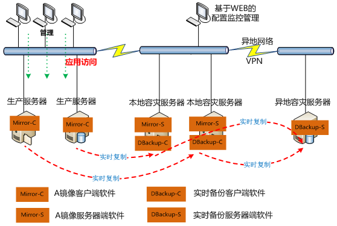
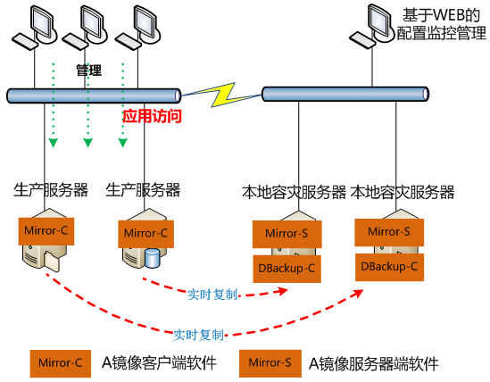
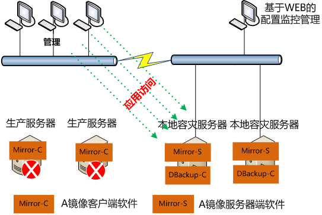
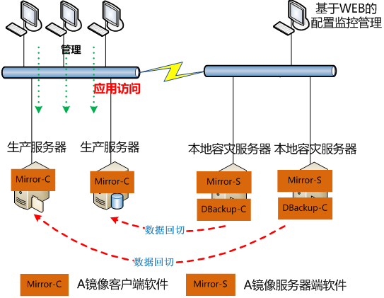
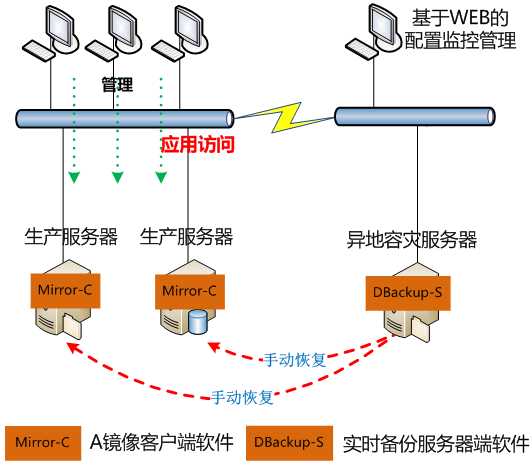
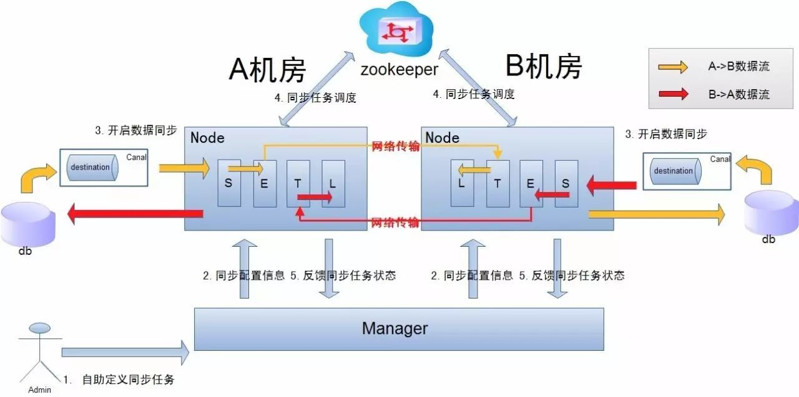
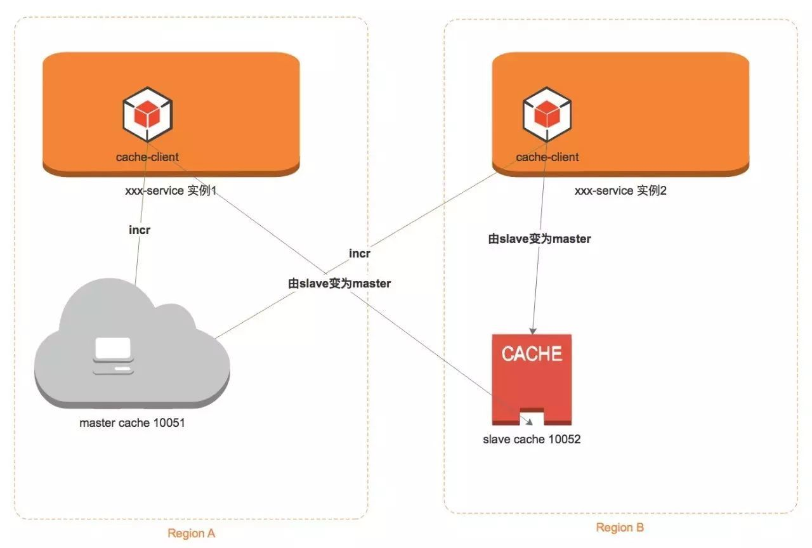
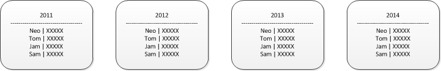
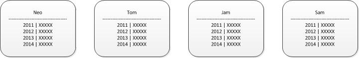
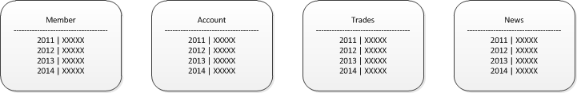

​                                            

# 服务器灾备解决方案--两地三中心(图文详解)

# 说明

灾备： 是指容灾和备份。**容灾是为了在遭遇灾害时能保证信息系统能正常运行**，帮助企业实现业务7*24小时连续性的目标，**备份是为了应对灾难来临时造成的数据丢失问题**。容灾备份产品的最终目标是帮助企业应对人为误操作、软件错误、病毒入侵等“软”性灾害以及硬件故障、自然灾害等“硬”性灾害。

两地三中心：

- 两地是指**同城、异地**
- 三中心是指**生产中心、同城容灾中心、异地容灾中心**。

**备端在线两地三中心灾备方案网络设计如下：**



# 容灾系统 衡量指标

衡量容灾系统的主要指标有

- **RPO(Recovery Point Object)** :灾难发生时允许丢失的数据量
- **RTO(Recovery Time Objective)** : 系统恢复的时间
- **容灾半径**: 生产系统和容灾系统之间的距离
- **ROI(Return of Investment)**: 容灾系统的投入产出比

**RPO** 是指业务系统所允许的灾难过程中的最大数据丢失量（以时间来度量），这是一个灾备系统所选用的数据复制技术有密切关系的指标，用以衡量灾备方案的数据冗余备份能力。

**RTO** 是指“将信息系统从灾难造成的故障或瘫痪状态恢复到可正常运行状态，并将其支持的业务功能从灾难造成的不正常状态恢复到可接受状态”所需时间，其中包括备份数据恢复到可用状态所需时间、应用系统切换时间、以及备用网络切换时间等，该指标用以衡量容灾方案的业务恢复能力。例如，灾难发生后半天内便需要恢复，则 RTO 值就是十二小时。

**容灾半径**是指生产中心和灾备中心之间的直线距离，用以衡量容灾方案所能防御的灾难影响范围。

容灾方案的 **ROI** 也是用户需要重点关注的，它用以衡量用户投入到容灾系统的资金与从中所获得的收益的比率。

显然，具有零 RTO 、零 RPO 和大容灾半径的灾难恢复方案是用户最期望的，但受系统性能要求、适用技术及成本等方面的约束，这种方案实际上是不大可行的。所以，用户在选择容灾方案时应该综合考虑灾难的发生概率、灾难对数据的破坏力、数据所支撑业务的重要性、适用的技术措施及自身所能承受的成本等多种因素，理性地作出选择。

**做灾备你面临最大的挑战是什么？**

- **Scalability(可扩展性)**
- **Availability(可用性)**
- **Performance(性能)**
- **Flexibility(灵活性)**

# 容灾级别

按照容灾系统对应用系统的保护程度可以分为**数据级容灾** 、 **应用级容灾** 和 **业务级容灾**。

**数据级容灾** 仅 将生产中心的数据复制到容灾中心，在生产中心出现故障时，仅能实现 存储 系统的接管或是数据的恢复 。容灾 中心的数据可以是本地生产数据的完全复制（ 一般 在同城实现） ， 也可以比生产数据略微落后，但必定是可用的 （一般 在异地实现） ， 而差异的数据 通常 可以通过一些工具（ 如 操作记录、日志等） 可以 手工补回。基于数据容灾 实现 业务恢复的速度 较慢 ，通常情况下 RTO 超过 24 小时， 但是这种 级别 的容灾系统运行维护成本较低。

**应用级容灾**是 在数据级容灾的基础上，进一步实现应用 可用性 ，确保业务的快速恢复。这就 要求 容灾系统 的 应用不能改变原有业务处理逻辑，是对生产中心系统的基本复制 。因此 ，容灾中心需要建立起一套和本地生产相当的备份环境，包括主机、网络、应用、 IP 等 资源均有配套，当 生产 系统发生灾难时，异地系统可以 提供 完全可用的生产环境。 应用级 容灾的 RTO 通常 在 12 个 小时 以内 ，技术复杂度较高，运行维护的成本也比较高。

**业务级容灾** 是生产中心 与容灾中心对业务请求同时进行 处理 的容灾方式，能够确保 业务 持续可用。这种 方式 业务 恢复 过程的自动化程度高， RTO 可以 做到 30 分钟 以内 。 但是 这种容灾级别 的 项目 实施难度大， 需要从 应用层对系统进行改造，比较适合流程固定 的 简单业务系统 。 这种 容灾系统 的运行维护成本最高。

# 同城容灾

**同城容灾** 是在同城或相近区域内 （ ≤ **200KM** ）建立两个数据中心 : 日常情况下可同时分担业务及管理系统的运行，并可切换运行；灾难情况下可在基本不丢失数据的情况下进行灾备应急切换，保持业务连续运行。

与异地灾备模式相比较，本地双中心具有投资成本低、建设速度快、运维管理相对简单、可靠性更高等优点；异地灾备中心是指在异地建立一个备份的灾备中心，用于双中心的数据备份，当双中心出现自然灾害等原因而发生故障时，异地灾备中心可以用备份数据进行业务的恢复。

# 异地容灾

**异地容灾** 主备中心之间的距离较远 （＞ **200KM** ) ， 因此一般采用异步镜像，会有少量的数据丢失。异地灾难备份不仅可以防范火灾、建筑物破坏等可能遇到的风险隐患，还能够防范战争、地震、水灾等风险。由于同城灾难备份和异地灾难备份各有所长，为达到最理想的防灾效果，数据中心应考虑采用同城和异地各建立一个灾难备份中心的方式解决。

# 备端在线容灾系统设计

1）当生产服务器处于正常工作状态时，把生产服务器的监控代理软件连接至服务器。当监控代理检测到主存储数据变化后，将捕获变化的数据实时的复制到备用存储上，实现了实时的复制。具体部署如下图：
 

2）当生产服务器故障，或者存储故障导致生产系统无法正常提供业务支持时，本地容灾服务器可直接接替生产服务器工作保障业务系统的持续运行；当本地机房发生灾难时，异地机房的容灾服务器可直接接替生产服务器工作保障业务系统的持续运行。具体部署如下图：
 
 3）当生产系统恢复工作后，代理软件会继续其生产服务器的复制工作，并且在这之前会通过回切工具保障主备系统数据一致，具体部署如下图：
 

# 异地容错的容灾系统设计

如果本地机房发生故障，将异地容灾服务器中备份的数据进行手动恢复，可以直接恢复到原生产服务器（也可恢复到新服务器）。备份存储系统保存了应用系统任意时刻的数据，恢复时可恢复到任意时间点，实现容错，具体部署如下图：
 

# 具体实施面临的问题

**1. 分类**
 根据是否需要数据同步大体分为三类：
 1、必须同步型。（比如数据库）
 2、无须同步型。比如缓存，仅仅是当做缓存，就可以这样做（这个有待商榷，其实缓存也需要同步的，严格来说的话）。
 3、只能单活（对全局原子要求较高），不接受有一定时延的“不一致”窗口。

**2. 核心问题**

数据同步、网络时延。

**3. 切换方式**

1、自动切换。自动切换表现为当灾难来临时，程序内部可以自动识别出问题然后切换至可用机房。
 2、手动切换。通过简单的配置，在几分钟或者一两小时内切换到另外的机房。

**4. 异地多活面临的挑战**

4.1、切换问题。
 切换问题不仅仅是灾难发生自动切换到好的机房，还有另外一个问题，就是灾难机房恢复能力后，如何再切换回去，切换回去的数据同步问题又是需要解决的。

4.2、跨机房流量问题。
 跨机房的流量是花钱的。所以不是无限大的。控制跨机房消息体大小，越小越好。然而，很多时候要想保证数据同步是一件很耗费流量的事情。但跨机房流量真的是一座山。

既然跨机房流量有限制，而且不稳定。所以有一种解决方案就是不跨机房。既然不跨机房就要做用户分区，确保每个用户只能访问自己所在的区，这样至少能保证该用户自己的数据的完整。

4.3、所有的业务都适合做异地双活吗？

异地多活效果看起来很诱人，但如果不假思索贪大求全的要求所有业务都实现异地多活的话，就会把自己带到坑里去。

第一个原因是异地多活是有成本的，包括开发成本和维护成本。需要实现异地多活的业务越多，方案越复杂，投入的设计开发时间越多；同时维护成本也会越高，需要更多的机器，需要更多的带宽。

第二个原因是有的业务理论上就无法实现异地多活。典型的有“余额”和“库存”这两个业务。

以余额为例，假设我们实现了余额的异地多活业务，用户小明有10000块钱，在A机房给女友转账了5000块，还剩余5000块；如果此时A机房异常且数据还没同步到B机房，小明登录到B机房发现自己又有10000块了，小明感觉中彩票了，赶紧又转了10000块给女友，最后出现了小明只有10000块却转账了15000块的问题，对于和资金相关的业务，这样的问题是绝对无法容忍的，哪怕一个用户有问题都不行。

所以，异地多活也不能保证所有业务都异地多活，在设计异地多活方案的时候，需要从业务和用户的角度出发，识别出核心和关键业务，明确哪些业务是必须实现异地多活，哪些是可以不实现异地多活，哪些是不能实现异地多活的。比如“登录”必须实现异地多活、“注册”和“修改用户信息”不一定要实现异地多活。

4.4、冷备还是热备。冷备了以后，一直冷备，当真正出现问题，你还有勇气去切换到那个一直冷的机房吗？恐怕需要点勇气。

4.5、数据一致性问题。

解决方案：
 （1）守护进程同步。
 （2）客户端双写。
 （3）不去解决。不需要解决的前提是用户分区。分区后，从本质上说，其实是没有做到双活的。只是看起来一个业务确实被分到了多个机房而已。

4.6、读取问题。

这个相对来说要好解决一些，就是就近读取。
 业务以及基础组件异地双活方案

# 数据库的异地双活

**Zookeeper异地双活**

先来点背景知识：
 1、**zookeeper**中的**server**机器之间会组成**leader/follower**集群，`1:n`的关系。采用了**paxos**一致性算法保证了数据的一致性，就是**leader/follower**会采用通讯的方式进行投票来实现**paxos**。

2、**zookeeper**还支持一种**observer**模式，提供只读服务不参与投票，提升系统。

异地多活决定了我们需要进行跨机房操作，比如杭州，美国，香港，青岛等多个机房之间进行数据交互。

跨机房之间对应的网络延迟都比较大，比如中美机房走海底光缆有**ping**操作**200ms**的延迟，杭州和青岛机房有**70ms**的延迟。

为了提升系统的网络性能，在部署**zookeeper**网络时会在每个机房部署节点，多个机房之间再组成一个大的网络保证数据一致性。(**zookeeper**千万别再搞多个集群)。
 说明：
 a. 数据涉及网络传输，`S/E/T/L`几个阶段会分散在2个或者更多**Node**节点上，多个**Node**之间通过**zookeeper**进行协同工作 (一般是**Select**和**Extract**在一个机房的**Node**，**Transform/Load**落在另一个机房的**Node**)

b. **node**节点可以有**failover/loadBalancer**. (每个机房的**Node**节点，都可以是集群，一台或者多台机器)
 

# 业务实例异地双活

业务实例的异地双活。这个相对来说要简单一些，只要做到无状态，再如果通过**Docker**这些容器结束，基本上是相对来说容易一些。

**消息队列的异地双活**

**rabbitmq** 每个机房部署一套**server**，然后每个机房的业务使用各自机房的**mq**。通过**haproxy**自动映射到本机房的**broker**。**topic**同步，通过**REST API**读取到

配置文件，然后同步到另外一个机房的**rabbitmq**下。

具体**REST API**：

```cpp
http://17X.XXX.X.XXX:15672/api/definitions
1
```

以上只是同步了**rabbitmq**的元数据，而且是全量同步。

消息同步问题：如果不同步会导致消息丢失。所以**mq**消息其实也是需要同步的。

同步可以通过客户端双写，或者服务端复制。双写更加容易。

**Redis的异地双活**

**Redis** 的异地双活。就是分别在每个机房搭建一套**Redis集群**。 然后每个机房的业务都去访问各自机房的**Redis集群**。

但这样只是能保证基本的缓存能力。如果业务中涉及到一些全局的原子操作，那么这样的做法显然不能满足需求。

原因很简单，比如你使用**redis incr**自增命令：

> a 机房 加1 后变为了1，b机房的业务也加1， 本来应该是2。结果由于各自都是访问了自己的**redis**，所以全局计数显然是有问题的。

怎么解决呢？就需要涉及到全局操作的业务，去单独的连接 一个全局的唯一的那个 **redis集群**，这个**redis集群**专门用于 业务的全局操作。

但这样的后果，就是会涉及到跨机房流量问题，因为这个全局的redis集群无论放在哪个机房，另外一个机房的业务要想访问都得跨机房。
 

# 大数据的问题

数据量最大的当属交易数据，有些金融产品双向交易，交易时间长，所以交易数据的累积相当可观。当交易数据积累到一定数量级，我们就可以从多角度数据挖掘，为决策提供数据支持。

**第一个阶分区表**
 第一个阶段数据分区存储，实施规划是五年之内。五年之内你可以使用分区这种技术存储数据。分许能够保持索引的连续，方便复杂的数据库查询。

**第二个阶分库分表**
 当数据庞大到无论怎么优化都无法提高查询性能是，这时你就要考虑数据库拆分了。

数据库拆分需要遵循几个原则，不仅仅是按照年份或月份分库分表。

**数据库拆分**

- 基于用户拆分，要能保证查询某个用户的数据不需要跨库，也不需要联合多表查询，这样会降低查询效率。
- 基于业务拆分，某些业务所用到的表，集中放在一台服务器上，保证数据查询不需要跨库，或者联合多表查询。
   图. 传统的分表方案
   

传统方法，将数据日期切分，这回带来索引的不连续问题，且查询时必须加带日期，以便定位到指定的表中。如果需要做数据挖掘，需要统计四年的数据，必须查询四次，效率大打折扣。

图. 基于用户分表方案
 

新的拆分方案，通过哈西算法均匀的将用户分配到指定数据库中或表中。这样所有针对该用户的操作都能在同一个数据库中完成。

图. 基于功能分表方案
 

根据不同的功能拆分数据库或表，也是一种非常不错选择。

# 总结

灾备方案都是有成本和风险的，灾备也没有银弹，不可能打死所有的怪兽。还是随着业务发展，不断的演化才是王道。

# 参考

https://blog.51cto.com/zhaoshilei/1888923

http://blog.itpub.net/26736162/viewspace-2216584/

https://cloud.tencent.com/developer/article/1082855

https://baike.baidu.com/item/%E5%AE%B9%E7%81%BE%E5%A4%87%E4%BB%BD

https://www.netkiller.cn/journal/trader.html